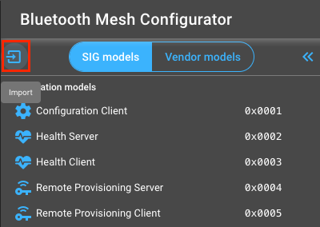
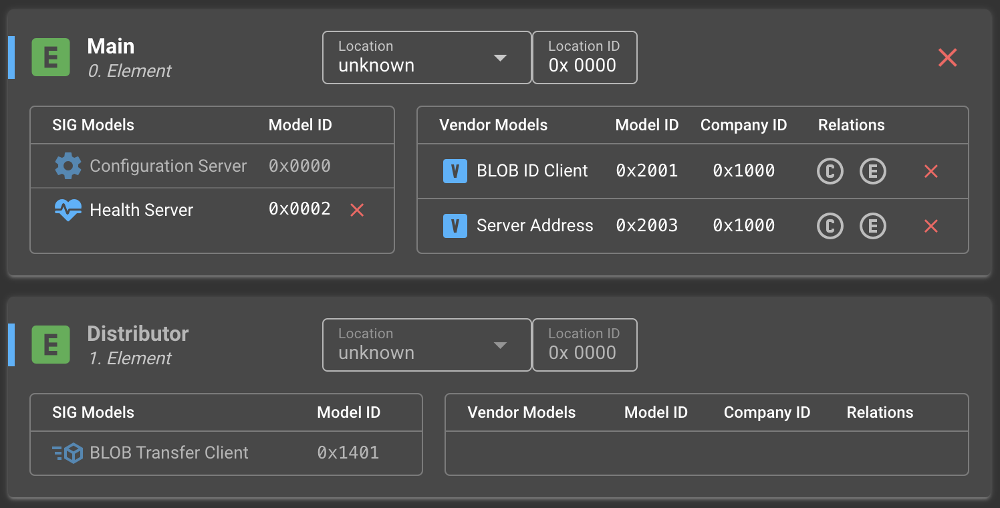
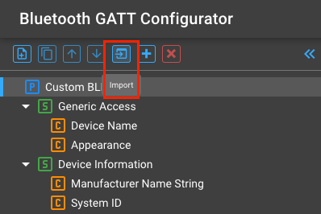
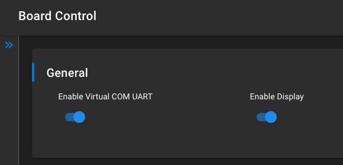
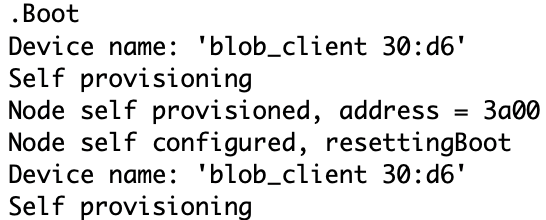
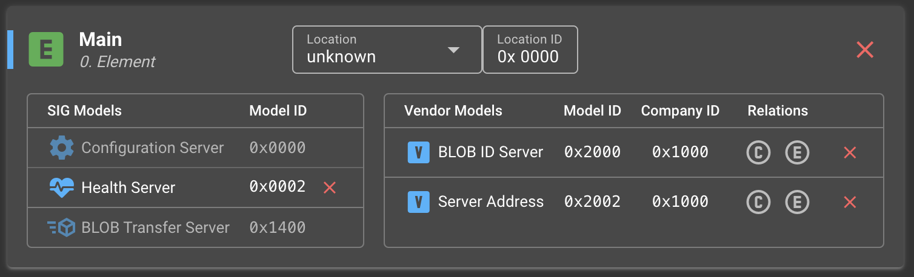
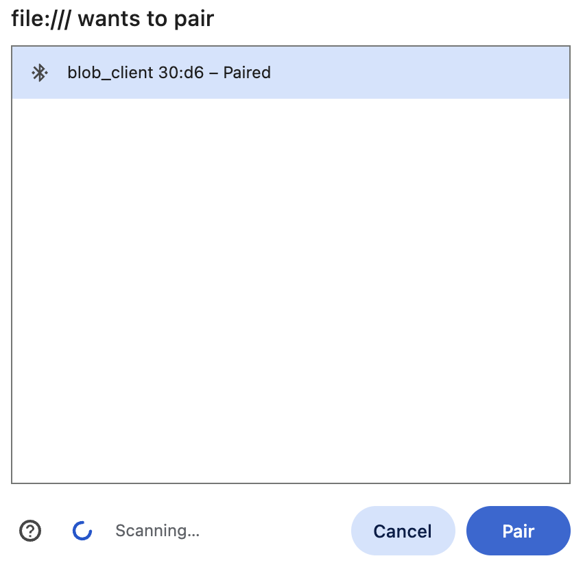
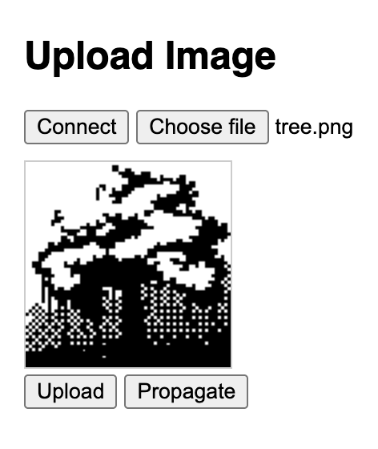
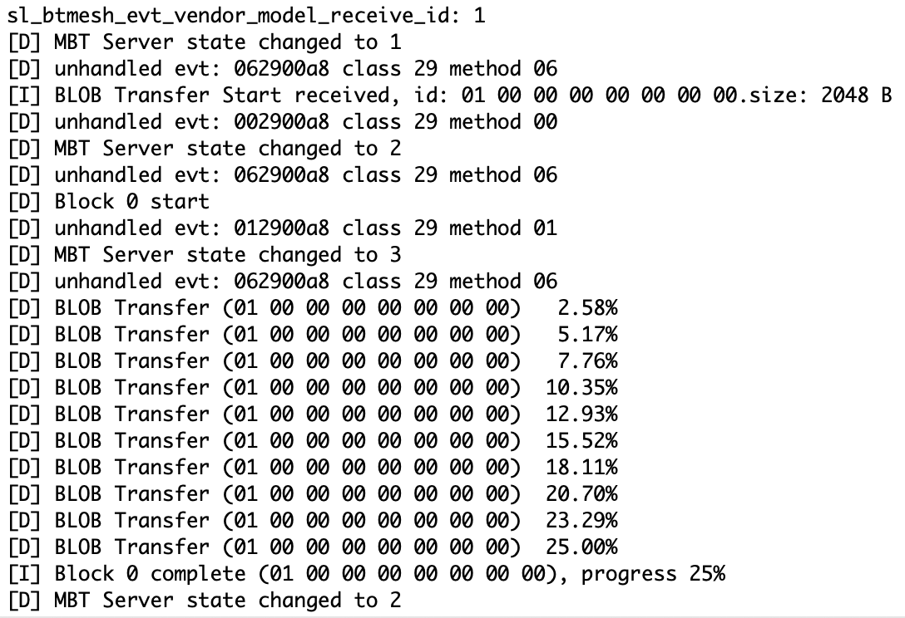

# BLOB Transfer Model Examples #

## Description ##

This example demonstrates mesh models capable of transferring binary large objects, called BLOBs, over a Bluetooth mesh network. The BLOB Transfer Server model and BLOB Transfer Client model are used to transport data for a higher-layer application. BLOB transfer is the process of sending a BLOB from a BLOB Transfer Client model to one or more BLOB Transfer Server models. BLOB transfer is able to transfer data objects that are much larger than the maximum Access Layer PDU size. BLOB transfer supports multicasting of the BLOB to many nodes simultaneously.

The BLOB Transfer Model is still a working draft of a potential Bluetooth specification at the time of writing this Readme. It is subject to change and Bluetooth SIG is not required to finalize or adopt it. Silicon Labs implements these Models to provide Device Firmware Update via the Mesh network and this example is aimed to demonstrate other possible uses of these Models.

## Simplicity SDK version ##

SiSDK v2025.6.0

---

## Important

> ⚠ You are not required to follow through with the setup part of the Instructions when using our [*External Repos*](../../README.md) feature!

This project README assumes that the reader is familiar with the usage of SiliconLabs Simplicity Studio 5 and the provided example projects within it.

---

## Requirements

  - Simplicity Studio 5 with the latest SiSDK
  - At least 2x SiliconLabs WSTK with Radio Boards (for example BRD4187C)

## Known limitations:

  - The WebApp is only usable in browsers with Blink engine: https://developer.mozilla.org/en-US/docs/Web/API/Web_Bluetooth_API

## Instructions

  - The example contains files for two separate projects, a Client and a Server node, placed in the appropriately named folders
  - For the Client, create a new project based on the ```Bluetooth Mesh - SoC Empty``` example
  - Copy the following files into the root directory of your project, overwriting the already existing ones:
    - client/src/app.c
    - client/inc/app.h
  - Install the following components:
    - Application > Utility > Button Press
    - Bluetooth Mesh > Utility > Factory Reset
    - Bluetooth Mesh > Stack > Test
    - Bluetooth Mesh > Stack > Models > Vendor Model
    - Bluetooth Mesh > Models > Transport > BLOB Transfer Client
    - Services > IO Stream > Driver > IO Stream: USART (keep the original ```vcom/exp``` name)
    - Application > Utility > Log
    - Platform > Driver > GLIB Graphics Library

  

  - Import the DCD configuration file (overwriting the default one). This will add the two necessary Vendor Models for the BLOB ID and Server Address exchanges.
  
  
  

  - Import the GATT configuration file as well, to include the Characteristic required for the image upload.

  

  - Switch on the ```Enable Virtual COM UART``` and ```Enable Display``` options at Platform > Board > Board Control

  

  - When everything is configured, build and flash the project
  - When it successfully boots up, it is going to self-provision itself and starts to wait for the Server devices

  

  - In the next step, create the project for the Server device based on the ```Bluetooth Mesh - SoC Empty``` example
  - Copy the following files into the root directory of your project, overwriting the already existing ones:
    - server/src/app.c
    - server/inc/app.h
  - Install the following components:
    - Application > Utility > Button Press
    - Bluetooth Mesh > Utility > Factory Reset
    - Bluetooth Mesh > Stack > Test
    - Bluetooth Mesh > Stack > Models > Vendor Model
    - Bluetooth Mesh > Models > Transport > BLOB Transfer Server (keep the original ```inst``` name)
    - Services > IO Stream > Driver > IO Stream: USART (keep the original ```vcom/exp``` name)
    - Application > Utility > Log
    - Platform > Driver > GLIB Graphics Library

  - Switch on the ```Enable Virtual COM UART``` and ```Enable Display``` options at Platform > Board > Board Control

  - Import the DCD configuration file (overwriting the default one). This will add the two necessary Vendor Models for the BLOB ID and Server Address exchanges (these are perfectly arbitrary values, but hardcoded!).

  

  - Import the GATT configuration file as well, to ensure that all Characteristics are configured properly.

  - When everything is configured, build and flash the project (to one or more devices) and watch them boot up

  

  - To fully demonstrate the BLOB Transfer, lets upload some data into the Client device. You may upload any image you like, but keep in mind that it is going to be transformed into a 128x128 monochrome image, so details will be lost. To accomplish this, open the ```web_app/image_uploader.html``` file in your selected, Blink-powered browser and hit Connect. Select the BLOB Client which is advertising itself.

  

  - Click Choose file, browser for you image, then hit Upload. The image should pop up on the WSTK LCD.

  

  - Finally, with a click of the Propagate button, the image is going to be transferred to the subscribed BLOB Servers.

  

## Troubleshooting

  - Factory reset can be accomplished with pressing BTN0 while resetting the device
  - On Windows operating systems there are certain caveats, that one should pay attention to:
    - Preliminary pairing and reconnection might be necessary between the dev board and the computer
    - The operating system might show a different name for the dev board, due to name-caching
    - The browser might find the dev board easier, if it is inspected first on chrome://bluetooth-internals/#devices

---