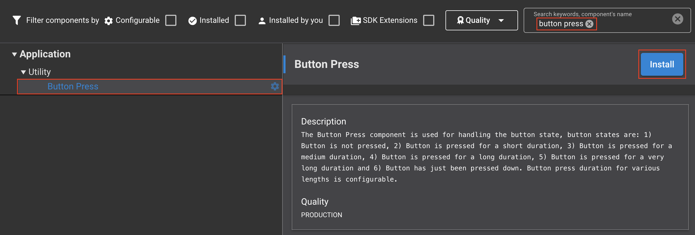
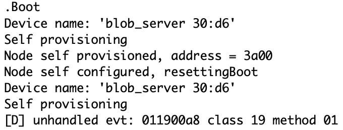

# BLOB Transfer Model Example #

## Description ##

This example demonstrates mesh models capable of transferring binary large objects, called BLOBs, over a Bluetooth mesh network. The BLOB Transfer Server model and BLOB Transfer Client model are used to transport data for a higher-layer application. BLOB transfer is the process of sending a BLOB from a BLOB Transfer Client model to one or more BLOB Transfer Server models. BLOB transfer is able to transfer data objects that are much larger than the maximum Access Layer PDU size. BLOB transfer supports multicasting of the BLOB to many nodes simultaneously.

The BLOB Transfer Model is still a working draft of a potential Bluetooth specification at the time of writing this Readme. It is subject to change and Bluetooth SIG is not required to finalize or adopt it. Silicon Labs implements these Models to provide Device Firmware Update via the Mesh network and this example is aimed to demonstrate other possible uses of these Models.

## Gecko SDK version ##

GSDK v4.4.1 or newer

---

## Important

> ⚠ You are not required to follow through with the project setup part of the Instructions when using our *External Repos* feature!

This project README assumes that the reader is familiar with the usage of SiliconLabs Simplicity Studio 5 and the provided example projects within it.

---

## Requirements

  - Simplicity Studio 5 with the latest GSDK
  - At least 2x SiliconLabs WSTK with Radio Boards (for example BRD4186C)
  - Python3 environment with the followings installed via ```pip```:
    - ffmpegio
    - pillow
    - numpy
    - serial

## Instructions

  - The example contains files for two separate projects, a Client and a Server node, placed in the appropriately named folders
  - For the Client, create a new project based on the ```Bluetooth Mesh - SoC Empty``` example
  - Copy the following files into the root directory of your project, overwriting the already existing ones:
    - client/src/app.c
    - client/inc/app.h
  - Install the following components:
    - Application > Utility > Button Press
    - Bluetooth Mesh > Stack > Test
    - Bluetooth Mesh > Stack > Provisioner
    - Bluetooth Mesh > Stack > Models > Vendor Model
    - Bluetooth Mesh > Stack > Models > Core > Configuration Client
    - Bluetooth Mesh > Models > Transport > BLOB Transfer Client
    - Services > IO Stream > Driver > IO Stream: USART (keep the original ```vcom``` name)
    - Application > Utility > Log
    - Platform > Driver > GLIB Graphics Library

  

  - Add the Configuration Client Model in the Bluetooth Mesh Configurator to the Main Element (skipping this would result in SL_STATUS_BT_MESH_DOES_NOT_EXIST ((sl_status_t)0x0502))
 
  

  - Still in the Bluetooth Mesh Configurator, add a specific Vendor Model to the database (Company ID 0x1000, Model ID 0x2001), to be able to transfer the ID of the new BLOB to the Servers (these are perfectly arbitrary values, but hardcoded!)
 
  

  - Increase the field values meant to store the data for Provisioned Devices (0 by default) at Bluetooth Mesh > Stack > Bluetooth Mesh Stack as per your needs
    - Maximum number of provisioned devices allowed
    - Maximum number of Application Keys allowed for each Provisioned Device
    - Maximum number of Network Keys allowed for each Provisioned Device
    - Max Foundation Client Cmds
      - For detailed explanation of these fields see: https://www.silabs.com/documents/public/user-guides/ug472-bluetooth-mesh-v2x-node-configuration-users-guide.pdf

  
  

  - Switch on the ```Enable Virtual COM UART``` option at Platform > Board > Board Control

  

  - As the default configured system resources maybe scarce, if you receive the following error: ```080100a0```, consider increasing the Bluetooth stack buffer at Bluetooth > Stack > Bluetooth Core

  

  - When everything is configured, build and flash the project
  - When it successfully boots up, it is going to create the Mesh network and starts to listen for the Server device advertisements

  

  - In the next step, create the project for the Server device based on the ```Bluetooth Mesh - SoC Empty``` example
  - Copy the following files into the root directory of your project, overwriting the already existing ones:
    - server/src/app.c
    - server/inc/app.h
  - Install the following components:
    - Bluetooth Mesh > Stack > Models > Vendor Model
    - Bluetooth Mesh > Models > Transport > BLOB Transfer Server
    - Services > IO Stream > Driver > IO Stream: USART (keep the original ```vcom``` name)
    - Application > Utility > Log
    - Platform > Driver > GLIB Graphics Library
  - Switch on the ```Enable Virtual COM UART``` option at Platform > Board > Board Control

  - In the Bluetooth Mesh Configurator, add a specific Vendor Model to the database (Company ID 0x1000, Model ID 0x2000), to be able to receive the ID of the new BLOB (these are perfectly arbitrary values, but hardcoded!)
 
  

  - When everything is configured, build and flash the project (to one or more devices)
  - When the Server device goes online, it will instantly starts to advertise, and gets to be provisioned as soon as the Client notices it (this can take some time)

  
  

  - To fully demonstrate the BLOB Transfer, lets update some data into the Client device. For this, you may have to disconnect with the Terminal software, as it is blocking the Serial port used for the image upload. You may upload any image you like, but keep in mind that it is going to be transformed into a 128x128 monochrome image, so details will be lost.
  - To upload the image, look up the serial port of the Client device and choose your image (or one of the two, in the script folder) and start the upload with ```python ./stream.py -p /dev/tty.usbmodem0004402253221 -i ./tree.png``` (this is a macOS style naming, your serial port name might be different).
  - When the image appears on the Client LCD, reconnect with the Terminal software (to see the progress) to the CLient and by pressing ```Button 0``` for approximately 3 seconds, the stored image will be transferred to all connected Servers.
  - Fun fact: You may stream short videos (hence the ffmpgeio library) via the serial port to the Client device with the ```./stream.py -v``` switch, but the transport is too slow, to do this via the Mesh network.

---