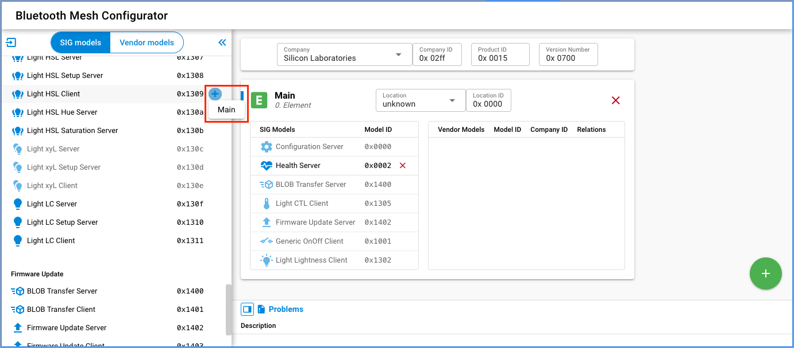
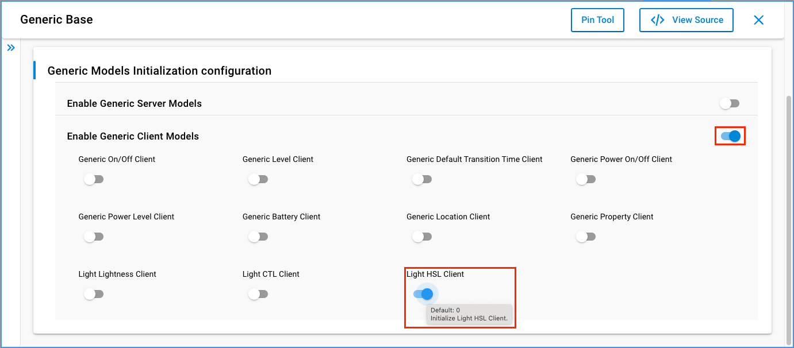

# HSL Lighting Client Example

## Introduction

Lighting is an important BT Mesh application scenario. Here, we discuss the lighting terminology and how our stack handles it.

### How We Describe Color
Nowadays, lighting is not only for ON/OFF, most of the lights do provide color settings.

There are 4 primary ways to describe a color.


- Hue, another word for color, degree on the color wheel from 0 to 360
  - 0 is red
  - 120 is green
  - 240 is blue

- Saturation(chroma), the intensity or purity of a hue, a percentage value
  - 0% means a shade of gray
  - 100% is the full color

- Lightness, the relative degree of black or white mixed with a given hue, also a percentage value
  - 0% is black
  - 50% is neither light or dark
  - 100% is white

- Temperature, the perceived warmth or coolness of a color, measured in degrees Kelvin (K)


### HSL Control Topology


The ```Bluetooth Mesh - SoC Light HSL``` is an example application that you can use as a template for Bluetooth Mesh HSL Light applications.

Currently the ```Bluetooth Mesh - SoC Switch``` does not support HSL Client (i.e. cannot set hue or saturation), so the switch side needs some porting job.

## Simplicity SDK version ##

SiSDK v2024.6.0

---

## Important

> ⚠ You are not required to follow through with the setup part of the Instructions when using our [*External Repos*](../../README.md) feature!

This project README assumes that the reader is familiar with the usage of SiliconLabs Simplicity Studio 5 and the provided example projects within it.

---

## Requirements

  - Simplicity Studio 5 with the latest SiSDK
  - SiliconLabs WSTK with Radio Board for the Switch (for example BRD4187C)
  - SiliconLabs Thunderboard with RGB LED (for example BRD4166A - this is a Series 1 device, so latest GSDK will be required as well!)

## Project Setup
### HSL Switch
  - Create a new project based on the ```Bluetooth Mesh - SoC Switch CTL``` example
  - Copy the following files into the root directory of your project, overwrite the already existing ones:
    - src/app.c
    - inc/btmesh_change.h
    - src/btmesh_change.c
    - inc/btmesh_hsl_client.h
    - src/btmesh_hsl_client.c
  - Install the following components:
    - Bluetooth Mesh > Models > Time and Scenes > Scene Client
  - Add the `Light HSL Client` model in the Bluetooth Mesh Configurator to the Main Element

  

  - Enable the `Generic Client Models` in the `Bluetooth Mesh > Models > Generic > Generic Base` component Configuration and activate the `Light HSL Client` Model, as well (you may manually alter these macros in the `sl_btmesh_generic_base_config.h` file).

  

  - Configure the publish parameter as below, demo project has 7 HSL combinations to demonstrate the color changing.

  ```c
  void sl_btmesh_set_hsl(uint8_t new_hsl)
  {
    char *color[HSL_INDEX_MAX]={"Off","Red","Green","Blue","Orange","Pink","Purple"};
    //{hue(0-360 degree), saturation(0-100%),lightness(0-100%)}
    uint16_t hsl_table[HSL_INDEX_MAX][3] = {
        {0,0,0},       //Off
        {0,100,50},    //Red
        {120,100,50},  //Green
        {240,100,50},  //Blue
        {39,100,50},   //Orange
        {300,76,72},   //Pink
        {248,53,58},   //Purple
    };
    target_hue = (double)hsl_table[new_hsl][0]/360*65535;
    target_saturation = (double)hsl_table[new_hsl][1]/100*65535;
    target_lightness = (double)hsl_table[new_hsl][2]/100*65535;
    //...
  }
  ```
  ```c
  static void send_hsl_request(uint8_t retrans)
  {
    //...
    req.kind = mesh_lighting_request_hsl;
    req.hsl.hue = target_hue;
    req.hsl.saturation = target_saturation;
    req.hsl.lightness = target_lightness;
    //...
    sc = mesh_lib_generic_client_publish(MESH_LIGHTING_HSL_CLIENT_MODEL_ID,
                                         BTMESH_HSL_CLIENT_MAIN,
                                         hsl_trid,
                                         &req,
                                         IMMEDIATE,     // transition
                                         delay,
                                         NO_FLAGS       // flags
                                         );
    //...
  }
  ```

## Testing
### HSL Light
Use the default Simplicity Studio ```Bluetooth Mesh - SoC HSL Light``` project.
For observing the color changes made by the HSL client, the recommend HW is Thunderboard Sense 2 (BRD4166A).
The color of the light is controlled by rgb_led_set().


### Provisioner
There is an NCP Provisioner C Example for Bluetooth Mesh.
```./simplicity_sdk/app/btmesh/example_host/btmesh_host_provisioner```
This can be used to provision the HSL light and switch and so can be our Bluetooth Mesh App.

### Test Log
Each medium-long key press on BTN0 will send the HSL client a control message, then the light will change its color accordingly.

