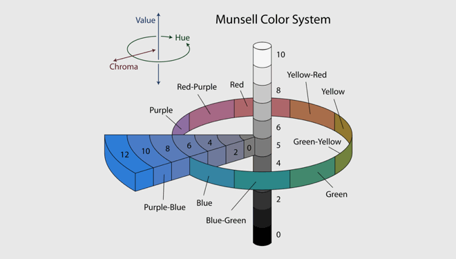
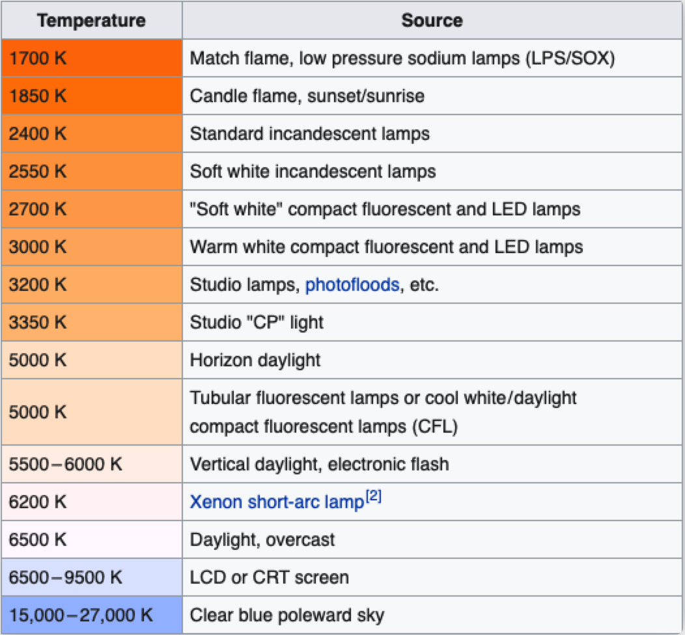
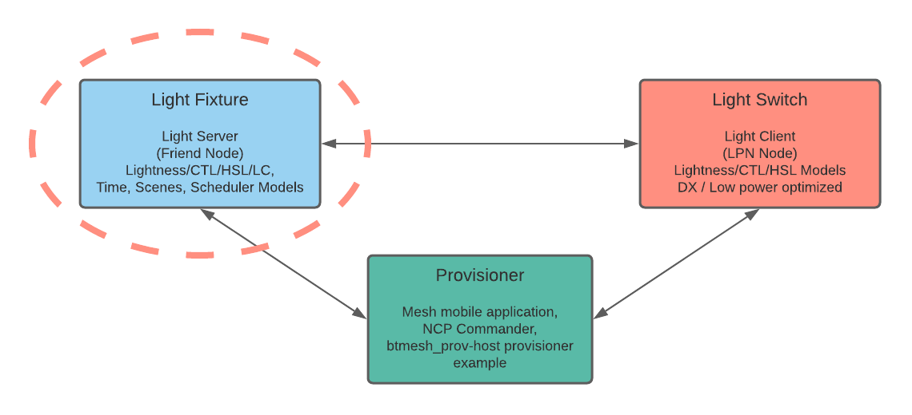
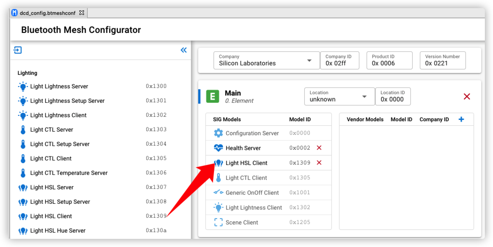
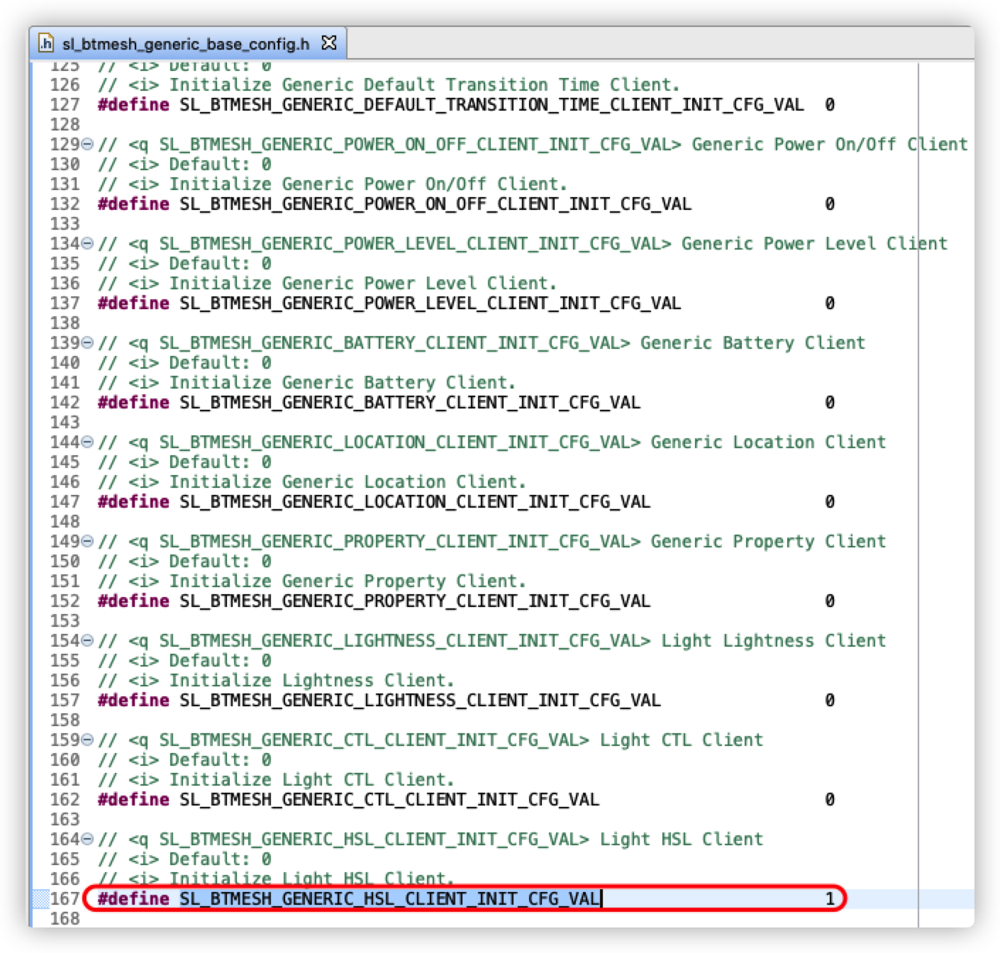
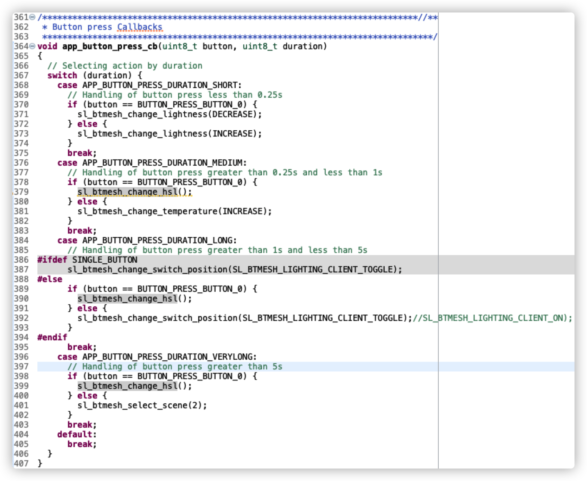

# HSL Lighting Client Example

## Introduction

Lighting is an important BT Mesh application scenario. Here, we discuss the lighting terminology and how our stack handles it.

### How We Describe Color
Nowadays, lighting is not only for ON/OFF, most of the lights do provide color settings.

There are 4 primary ways to describe a color.



- Hue, another word for color, degree on the color wheel from 0 to 360
  - 0 is red
  - 120 is green
  - 240 is blue

- Saturation(chroma), the intensity or purity of a hue, a percentage value
  - 0% means a shade of gray
  - 100% is the full color

- Lightness, the relative degree of black or white mixed with a given hue, also a percentage value
  - 0% is black
  - 50% is neither light or dark
  - 100% is white

- Temperature, the perceived warmth or coolness of a color, measured in degrees Kelvin (K)



### HSL Control Topology


The ```Bluetooth Mesh - SoC Light HSL``` is an example application that you can use as a template for Bluetooth Mesh HSL Light applications.

Currently the ```Bluetooth Mesh - SoC Switch``` does not support HSL Client (i.e. cannot set hue or saturation), so the switch side needs some porting job.

## Important

> ⚠ You are not required to follow through with the Instructions when using our *External Repos* feature!

## Project Setup
### HSL Switch
1) Create a ```Bluetooth Mesh - SoC Switch``` project and add the `Light HSL Client` model. The example can run on EFR32 boards which support BT Mesh, the provided project file is tested on xG21 (BRD4181A).



2) Check `SL_BTMESH_GENERIC_HSL_CLIENT_INIT_CFG_VAL` on `sl_btmesh_generic_base_config.h`, if not set then set it.


  
3) Copy the provided `btmesh_hsl_client.c` and `btmesh_hsl_client.h` files into the project folder.

Configure the publish parameter as below, demo project has 7 HSL combinations to demonstrate the color changing.
  ```c
  void sl_btmesh_set_hsl(uint8_t new_hsl)
  {
    uint16_thsl_table[HSL_INDEX_MAX][3] = {
        {0,0,0},       //Off
        {0,100,50},    //Red
        {120,100,50},  //Green
        {240,100,50},  //Blue
        {39,100,50},   //Orange
        {300,76,72},   //Pink
        {248,53,58},   //Purple
    };
    target_hue = (double)hsl_table[new_hsl][0]/360*65535;
    target_saturation = (double)hsl_table[new_hsl][1]/100*65535;
    target_lightness = (double)hsl_table[new_hsl][2]/100*65535;
    //...
  }
  ```
  ```c
  static void send_hsl_request(uint8_t retrans)
  {
    //...
    req.kind = mesh_lighting_request_hsl;
    req.hsl.hue = target_hue;
    req.hsl.saturation = target_saturation;
    req.hsl.lightness = target_lightness;
    //...
    sc = mesh_lib_generic_client_publish(MESH_LIGHTING_HSL_CLIENT_MODEL_ID,
                                      BTMESH_HSL_CLIENT_MAIN,
                                      hsl_trid,
                                      &req,
                                      IMMEDIATE,     // transition
                                      delay,
                                      NO_FLAGS       // flags
                                      );
    //...
  }
  ```

4) Replace the `app.c` file, invoke sl_btmesh_change_hsl() in app_button_press_cb()


## Testing
### Gecko SDK Version
Tested on GSDK v4.3.1

### Hardware Required
- Wireless STK Mainboard and EFR32xG21 Radio Board.
- Thunderboard Sense 2, it has RGB LED, better for demonstrating the color variations.

### HSL Light
Use the default Simplicity Studio ```Bluetooth Mesh - SoC HSL Light``` project.
For observing the color changes made by the HSL client, the recommend HW is Thunderboard Sense 2 (BRD4166A).
The color of the light is controlled by rgb_led_set().


### Provisioner
There is an NCP Provisioner C Example for Bluetooth Mesh.
```SimplicityStudio/SDKs/gecko_sdk/app/btmesh/example_host/btmesh_host_provisioner```
This can be used to provision the HSL light and switch and so can be our Bluetooth Mesh App.

### Test Log
Each key press on button 0 will send the HSL client a control message, then the light will change its color accordingly.
