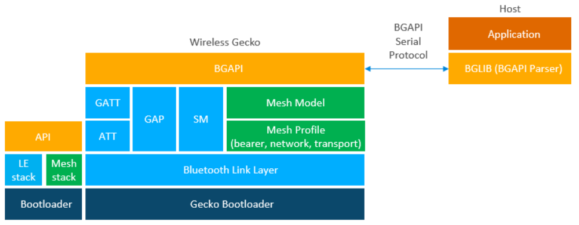
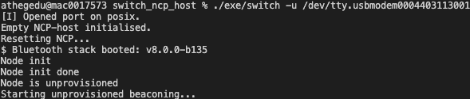
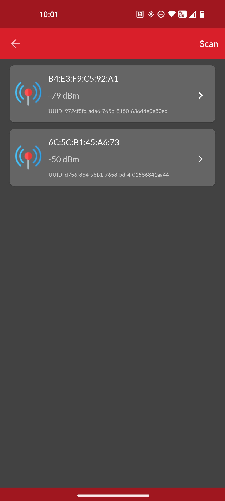
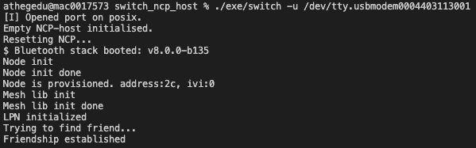
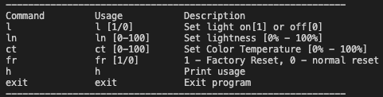

# Switch NCP Host Example

## Introduction

The Silicon Labs Bluetooth mesh stack is an advanced Bluetooth mesh protocol stack implementing the Bluetooth mesh standard. It
can run alongside the Bluetooth Low Energy (LE) stack, using a common link layer, which allows using LE features in parallel. The
Silicon Labs Bluetooth mesh stack is meant for Silicon labs Wireless Gecko SoCs and modules.

Network Co-Processor (NCP) mode, where the Bluetooth stack runs in a Wireless Gecko and the application runs on a separate
host MCU. For this use case, the Bluetooth stack can be configured into NCP mode where the API is exposed over a serial interface such as UART.



---

## Simplicity SDK version ##

SiSDK v2024.12.0

## Important

This project README assumes that the reader is familiar with compiling source codes with ```make``` and various compilers and with the usage of SiliconLabs Simplicity Studio 5 and the provided example projects within it.

---

## Requirements

 - GNU make
 - MinGW for Windows /  GCC for Linux / Clang for macOS
 - Simplicity Studio 5 with the latest SiSDK
 - 2x SiliconLabs WSTK with Radio Boards (for example BRD4187C)

---

## Instructions

 - Prepare your environment with the required compiling tools.
 - Run ```make``` in the root folder of the project.
 - Optionally, set the ```SDK_DIR``` environment variable to the path of your chosen SiSDK (i.e. ```make SDK_DIR=/Users/<user>/SimplicityStudio/SDKs/simplicity_sdk```)
 - Flash one of the boards with ```Bluetooth Mesh - NCP Empty``` example (NCP board) and the other one with ```Bluetooth Mesh - SoC Light``` (Standalone board) and fire them up.
 - Start the compiled desktop software with the proper arguments, eg.:
 ```sh
 ./exe/switch -u /dev/tty.usbmodem0004402253201 -b 115200
 ```
  - The ```-u``` should be the serial port of the NCP WSTK board and the ```-b``` is the default baudrate of 115200 bits/sec.
  - If everything went right, you will see the NCP board starting up:



  - If both of the WSTKs are running, provision them into the same network with SiliconLabs's own Bluetooth Mesh Application for Android/iOS.



  - After successful provisioning, create a Group for the two boards and assign them the roles of ```Light Lightness Client``` for the NCP and ```Light Lightness Server``` for the Standalone board.
  - The NCP board is configured as a Low Power Node, so turn on the Friend functionality for the Standalone node (Friendship should be estabilished after this).



  - If everything is fine, you should be able to control the LEDs of the Standalone board through the NCP board via the terminal with these commands (press Enter to get to the prompt):



---

## Mesh Publish

To see all the possible models to publish for, see ```sl_btmesh_model_specification_defs.h```.

```c
resp = mesh_lib_generic_client_publish(
    MESH_LIGHTING_LIGHTNESS_CLIENT_MODEL_ID,
    elemIndex,
    trid,
    &req,
    0,     // transition
    delay,
    0     // flags
    );
```