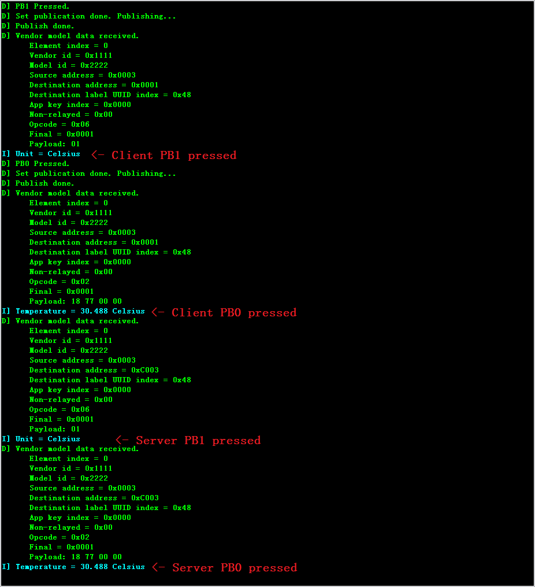

# Bluetooth Mesh Vendor Specific Model Example

## Introduction

This article aims at helping those developers who want to use the vendor specific models in their Bluetooth Mesh products.

### What are models?

The concept ‘model’ is defined in the section 2.3.6 of [Mesh Profile Specification v1.0.1](https://www.bluetooth.org/docman/handlers/downloaddoc.ashx?doc_id=457092). It’s good to understand the concept of client and server models. We will use this architecture in the following example.

### What are vendor models?

It’s also defined in the section 2.3.6 of [Mesh Profile Specification v1.0.1](https://www.bluetooth.org/docman/handlers/downloaddoc.ashx?doc_id=457092).

>Models may be defined and adopted by Bluetooth SIG and may be defined by vendors. Models defined by Bluetooth SIG are known as SIG adopted models, and models defined by vendors are known as vendor models. Models are identified by unique identifiers, which can be either 16 bits, for SIG adopted models, or 32 bits, for vendor models.

Before reading this article, it’s recommended to read the article - [Logging System](https://docs.silabs.com/bluetooth/latest/code-examples/tools/log-system). The logging output will be displayed on J-Link RTT Viewer or a serial terminal as introduced in that article.

## Environments

- IDE – [Simplicity Studio 5](https://www.silabs.com/developers/simplicity-studio)
- SDK – Bluetooth Mesh SDK 2.0.0 GA or newer
- Hardware – At least 3 Bluetooth Mesh compatible boards - EFR32xG12 or EFR32xG13 (x= M, B) based, SLWRB4104A and SLWRB4103A are recommended.
- Debug Terminal – J-Link RTT Viewer or a serial terminal. The serial connection parameters are:
  - Baud rate: 115200
  - Data bits: 8
  - Stop bit: 1
  - Flow control: False

## Details about the example

There are 3 projects in the example.

- prov_bg12_130 – It’s the embedded provisioner designed to run on the [SLWRB4103A](https://www.silabs.com/development-tools/wireless/bluetooth/slwrb4103a-efr32bg12-bluetooth-radio-board) board directly and used to provision the vendor devices. For more information, see <https://www.silabs.com/community/wireless/bluetooth/knowledge-base.entry.html/2018/05/31/bt_mesh_embeddedpro-qoHB>.
- vendor_model_client – The vendor client model
- vendor_model_server – The vendor server model

### Provisioning

In this example a node can be provisioned by a standard provisioner or by the node itself with test class commands. The symbol **PROV_LOCALLY** in the file *my_model_def.h* decides which way the node will use. If it is defined, the node will provision itself at boot time if it is unprovisioned, the server node will publish messages to the group address the client node subscribes to, and the client node will publish messages to the group address the server node subscribes to. If the symbol is not defined, the node will transmit unprovisioned device beacons at boot time, if they are unprovisioned, waiting for a provisioner to provision and configure it.

### Server and Client Model

There are 3 concepts to be introduced here before talking about the server and client models. See Figure 1, Figure 2 and Figure 3 below. These are the standard behaviors that the client and server models follow, which means all the opcodes defined later with the name “xxx Get/Set/Set unacknowledged” will use the “Reliable Get/Reliable Set/Unreliable Set”.

---

*Figure 1. Reliable Get*

*Figure 2. Reliable Set*

*Figure 3. Unreliable Set*

To be simple, there is only one group created and the provisioner configures both the client and server models to publish messages to and subscribe to the group. Below are the definitions for the client and server models:

- Vendor ID - 0x1111, a 16-bit Company Identifier, use this value only for demo purposes.
- Server Model ID – 0x1111
- Client Model ID – 0x2222
- States
  - Temperature – 4 bytes (uint32) to store the temperature value with the unit milliCelsius or milliFahrenheit.
  - Unit
    - 0x1 – Celsius
    - 0x2 – Fahrenheit
  - Update period – The period that the vendor server updates the temperature for the client periodically. The format of this value complies with the section 4.2.2.2 of Mesh Profile Specification v1.0.1.
- Opcodes
  - 0x1 – Temperature Get – it’s an acknowledged message used to get the Temperature Status of the server node.
  - 0x2 – Temperature Status – It's a message used to acknowledge to Temperature Get or to publish an update to the group.
  - 0x3 – Unit Get – it’s an acknowledged message used to get the Unit Status of the server node.
  - 0x4 – Unit Set – it’s an acknowledged message used to set the Unit Status of the server node.
  - 0x5 – Unit Set Unacknowledged – it’s an unacknowledged message used to set the Unit Status of the server node.
  - 0x6 – Unit Status – It's a message used to acknowledge to Unit Get or to publish an update to the group.
  - 0x7 – Update Period Get – It’s an acknowledged message used to get the Update Period Status of the server node.
  - 0x8 – Update Period Set – It’s an acknowledged message used to set the Update Period Status of the server node.
  - 0x9 – Update Period Set Unacknowledged – It’s an unacknowledged message used to set the Update Period Status of the server node.
  - 0xA – Update Period Status - It's a message used to acknowledge to Update Period Get or to publish an update to the group.
- Operations
  - For both nodes – holding down PB1 when the node is booting will trigger a factory reset, which will erase all stored data including network keys, application keys, the publication address, subscription addresses etc., and result in forcing the device to the unprovisioned state.
  - Client Model
    - Short Press PB0 – publish Temperature Get
    - Long Press PB0 – publish Update Period Set Unacknowledge with the following sequence parameters:
      - 300ms
      - Off
      - 2s
      - Off
      - 10s
      - Off
      - 2min
      - Off
      - 10min
      - Off
    - Short Press PB1 – publish Unit Get
    - Long Press PB1 – publish Unit Set (Celsius) and Unit Set Unacknowledged (Fahrenheit) in turn
  - Server Model
    - Press PB0 – measure the current temperature and publish Temperature Status
    - Press PB1 – publish Unit Status

## Running the example

This example is initially designed to use SLWRB4104A as the mesh nodes and SLWRB4103A as the provisioner. If you don’t have them, you probably need to adapt the existing projects to your boards. This article assumes that you have the desired boards and doesn't cover the software adaptation. Follow the steps below to run this example.

1. Download the code example and get the provisioner project from <https://github.com/silabs-kevin/vendor_model_provisioner>. Import the provisioner project to your Simplicity Studio. The step 2 and 6 below shall be skipped if using the self-provision method.

2. Build the provisioner project and flash the firmware image to a [SLWRB4103A](https://www.silabs.com/development-tools/wireless/bluetooth/slwrb4103a-efr32bg12-bluetooth-radio-board) board. You can optionally develop your own provisioner.

3. Create 2 projects in [Simplicity Studio 5](https://www.silabs.com/developers/simplicity-studio) named vmec (vendor model example client) and vmes (vendor model example server).

4. Copy the $(ROLE)_app.c, $(ROLE)_app.h, main.c, my_model_def.h and self_test.h to corresponding projects. Open config/btmeshconf/dcd_config.btmeshconf in your project and add a vendor model to the project in the Bluetooth Mesh Configurator. Set the server model ID to 0x11111111 and the client model ID to 0x22221111. Build the projects and flash at least one client and one server firmware images to boards.

5. Open multiple instances of RTT Viewer or serial terminals, connect them to your boards, and open a serial terminal connected to the provisioner.

6. The boards should have started transmitting unprovisioned beacons, and you should get messages printed on the serial terminal as shown in Figure 4. Press PB1 to start provisioning and configuration if it is your device waiting to be provisioned and configured, whereas, PB0 to ignore it.

*Figure 4. Provisioner Serial Terminal*

7. Make sure that all devices are properly provisioned and configured. If the provisioning and configuration go smoothly, you should see the “configuration complete” message on the serial terminal, and the provisioner continues scanning unprovisioned beacons.

8. Press buttons on the boards to verify the processes. If everything goes well, you should see logging messages on RTT Viewer like the figures below. Figure 5 and Figure 6 are a pair of nodes in the same network showing the actions – pressing PB1 on the client > pressing PB0 on the client > pressing PB1 on the server > pressing PB0 on the server.

*Figure 5. Client RTT Terminal*

*Figure 6. Server RTT terminal*

## Conclusion

This article doesn't introduce much the embedded provisioner project but we use it in this example because the Bluetooth Mesh smartphone app doesn't support vendor models yet. The embedded provisioner is not designed to be a generic provisioner as it has some settings hardcoded in the source code.

This example implements the periodical status update feature in the application layer. It can also be implemented by using the model publication state in the configuration server, as described in the section 4.2.2 of Mesh Profile Specification v1.0.1. Implementing this feature in the application layer is recommended as it doesn't need a configuration client which is usually the provisioner to modify the Publish Period parameter of the Publication state in the configuration server.
