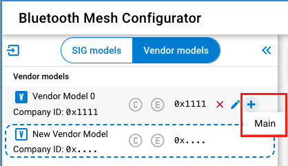
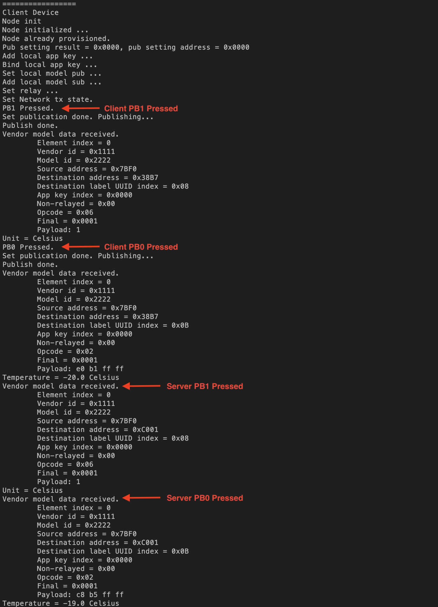
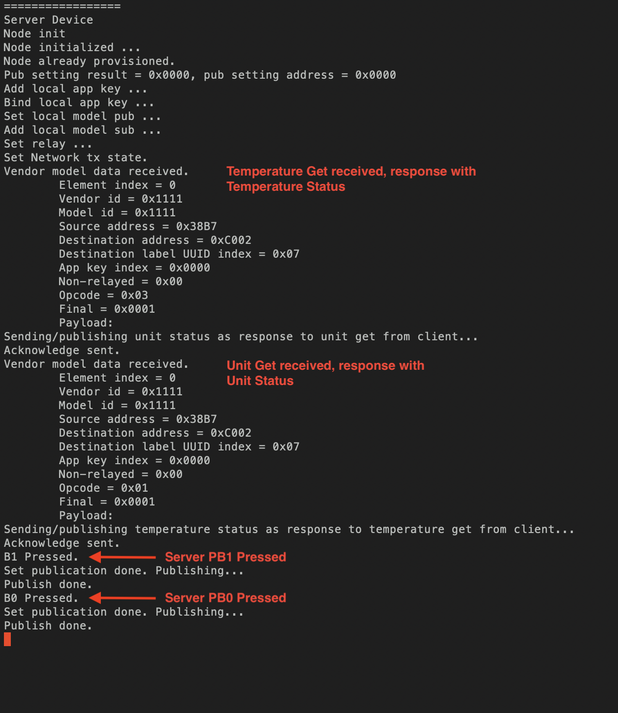

# Vendor Specific Model Examples

## Details
### Introduction
This example aims at helping those developers who want to use the vendor specific models in their Bluetooth Mesh products.

### What are Models?
The concept "Model" is defined in the section 2.3.6 of [Mesh Protocol Specification v1.1](https://www.bluetooth.com/specifications/specs/mesh-protocol/). It’s good to understand the concepts client and server model; in the following example, we will use this architecture.

### What are vendor models?
It’s also defined in the section 2.3.6 of [Mesh Protocol Specification v1.1](https://www.bluetooth.com/specifications/specs/mesh-protocol/).

> “Models may be defined and adopted by Bluetooth SIG and may be defined by vendors. Models defined by Bluetooth SIG are known as SIG adopted models, and models defined by vendors are known as vendor models. Models are identified by unique identifiers, which can be either 16 bits, for SIG adopted models, or 32 bits, for vendor models.”

## Simplicity SDK version ##

SiSDK v2024.6.0

---

## Important

> ⚠ You are not required to follow through with the setup part of the Instructions when using our [*External Repos*](../../README.md) feature!

This project README assumes that the reader is familiar with the usage of SiliconLabs Simplicity Studio 5 and the provided example projects within it.

---

## Requirements

  - Simplicity Studio 5 with the latest SiSDK
  - 2x SiliconLabs WSTK with Radio Boards (for example BRD4187C)

## Setup

### Vendor Server node

  - For the Vendor Server, create a new project based on the ```Bluetooth Mesh - SoC Empty``` example
  - Copy the following file into the root directory of your project, overwriting the already existing one:
    - server/src/app.c
    - server/inc/my_model_def.h
  - Install the following components:
    - Bluetooth > Application > Miscellaneous > Relative Humidity and Temperature sensor (Mock)
    - Bluetooth Mesh > Stack > Models > Vendor Model
    - Application > Utility > Button Press
    - Bluetooth Mesh > Stack > Test
    - Services > IO Stream > Driver > IO Stream: USART (keep the original ```vcom``` name)
    - Application > Utility > Log
  - Switch on the ```Enable Virtual COM UART``` option at Platform > Board > Board Control (except Thunderbirds)
  - In the *.slcp file, click the `Configuration Tools` tab then click `Bluetooth Mesh Configurator` to add the elements and models. Select the Vendor models tab, to create a new one. Set the `Model ID to 0x1111 and the Company ID to 0x1111` and then add it to the Main Element. Note this is for the Server Node. The example source code expects these values.



### Vendor Client node

  - For the Vendor Client, create a new project based on the ```Bluetooth Mesh - SoC Empty``` example
  - Copy the following file into the root directory of your project, overwriting the already existing one:
    - client/src/app.c
    - client/inc/my_model_def.h
  - Install the following components:
    - Bluetooth Mesh > Stack > Models > Vendor Model
    - Application > Utility > Button Press
    - Bluetooth Mesh > Stack > Test
    - Services > IO Stream > Driver > IO Stream: USART (keep the original ```vcom``` name)
    - Application > Utility > Log
  - Switch on the ```Enable Virtual COM UART``` option at Platform > Board > Board Control (except Thunderbirds)
  - In the *.slcp file, click the `Configuration Tools` tab then click `Bluetooth Mesh Configurator` to add the elements and models. Select the Vendor models tab, to create a new one. Set the `Model ID to 0x2222 and the Company ID to 0x1111` and then add it to the Main Element. Note this is for the Client Node. The example source code expects these values.

### Provisioner
This article does not go in depth about the provisioner. By default, the nodes are self-provisioned. To prevent the nodes from self-provision themselves, comment out the `#define PROV_LOCALLY` definition in my_model_def.h.

This [Embedded Provisioner Example](../../provisioning/embedded_provisioner/README.md) has more information and code on creating the Provisioner node.

## How It Works

### Factory Reset
A factory reset may be necessary if you run the FW for the first time. This is due to conflicting configuration data in flash and firmware.

Keep PB1 or PB0 pressed during reset to trigger a factory reset, which will erase all the stored data including the network keys, application keys, publication addresses, subscription addresses etc. and result in forcing the device into an unprovisioned state. Note that the PB0 and PB1 pin definitions may need to be changed in app.c, depending on the WSTK board used.

### Provisioning
The example supports both being provisioned by a standard provisioner, or being provisioned by the node itself, with the Test component commands. The symbol `PROV_LOCALLY` in the file `my_model_def.h` decides which way the node acts. If it is defined, the nodes will provision themselves at boot time when they are unprovisioned, and the server node will publish to the group address the client node subscribes to and subscribes to the group address that the client node publishes to, respectively. If the symbol is not defined, they will send out the unprovisioned device beacon after boot when they are unprovisioned, waiting for a provisioner to provision and configure them.

## Running the example
Open a serial terminal for each node. By default, the nodes will self-provision themselves. The following figures show what happens when you press `PB1 on client -> PB0 on client -> PB1 on server -> PB0 on server`.


<p align="center">
    Client Serial Terminal
</p>


<p align="center">
    Server Serial Terminal
</p>