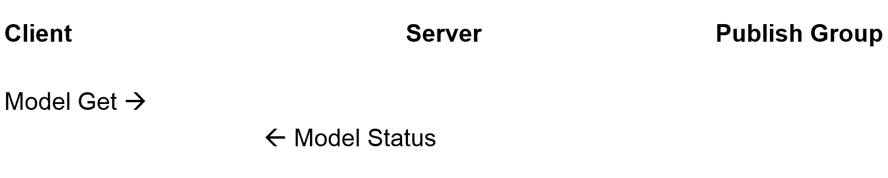
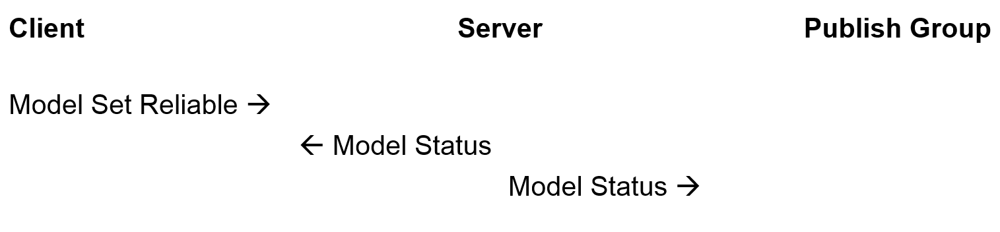

# Vendor Specifc Model Example

## Details
### Introduction
This article aims at helping those developers who want to use the vendor specific models in their Bluetooth Mesh products.

### What are Models?
The concept "Model" is defined in the section 2.3.6 of [Mesh Profile Specification 1.0](https://www.bluetooth.com/specifications/specs/mesh-profile-1-0-1/). It’s good to understand the concepts client and server model; in the following example, we will use this architecture.

### What are vendor models?
It’s also defined in the section 2.3.6 of [Mesh Profile Specification 1.0](https://www.bluetooth.com/specifications/specs/mesh-profile-1-0-1/).

> “Models may be defined and adopted by Bluetooth SIG and may be defined by vendors. Models defined by Bluetooth SIG are known as SIG adopted models, and models defined by vendors are known as vendor models. Models are identified by unique identifiers, which can be either 16 bits, for SIG adopted models, or 32 bits, for vendor models.”

## SDK version
Gecko SDK 3.2 or newer
- Bluetooth Mesh SDK 2.x or newer

## Hardware Required
At least 3 Bluetooth Mesh compatible boards. The following parts are what we recommend:
- EFR32xG21 or EFR32xG22 (x= M, B) SoCs
- xGM210 or xGM220 (x= M, B) Modules

*Note: The [EFR32BG21 or BGM210 parts](https://www.silabs.com/wireless/bluetooth/efr32bg21-series-2-socs) are ideal for line-powered Bluetooth Low Energy and Bluetooth Mesh applications, including connected lighting, smart plugs, gateways and voice assistants.*

## Setup

Create the vendor server node:
1. Create a new BT Mesh SoC Empty project called vendor_server
2. Copy app.c and my_model_def.h from the server folder and  into the top directory of the new project
3. Open the *.slcp file and click the "Software Components" tab. Install the following components:
    - Bluetooth Mesh > Stack Classes > Vendor Model
    - Bluetooth Mesh > Stack Classes > Test
4. In the *.slcp file, click the "Configuration Tools" tab then click "Bluetooth Mesh Configurator" to add the elements and models. (A new file should have opened)
5. In the Main element, click the '+' sign in the Vendor Models table to add a new vendor model. Set the Model ID to 0x1111 and the Company ID to 0x1111. Note this is for the server node. The example source code works for these values.
6. In app.c, change the button GPIO macro definitions if a different board is used

Create the vendor client node:
1. Create a new BT Mesh SoC Empty project called vendor_client
2. Copy app.c and my_model_def.h from the client folder and into the top directory of the new project
3. Open the *.slcp file and click the "Software Components" tab. Install the following components:
    - Bluetooth Mesh > Stack Classes > Vendor Model
    - Bluetooth Mesh > Stack Classes > Test
4. In the *.slcp file, click the "Configuration Tools" tab then click "Bluetooth Mesh Configurator" to add the elements and models. (A new file should have opened)
5. In the Main element, click the '+' sign in the Vendor Models table to add a new vendor model. Set the Model ID to 0x2222 and the Company ID to 0x1111. Note this is for the client node. The example source code works for these values.
6. In app.c, change the button GPIO macro definitions if a different board is used

## How It Works

### Factory Reset
A factory reset may be necessary if you run the FW for the first time. This is due to conflicting configuration data in flash and the firmware.

Keep PB1 or PB0 pressing while resetting to trigger a factory reset, which will erase all the stored data including the network key, application key, publication address, subscription addresses etc. and result in forcing the device to an unprovisioned state. Note that the PB0 and PB1 pin definitions may need to be changed in app.c depending on the WSTK board used.

### Provisioning
The example supports both being provisioned by a standard provisioner, or being provisioned by the node itself by the test class command. The symbol PROV_LOCALLY in the file my_model_def.h decides which way the node uses. If it is defined, the nodes will provisioned themselves at boot time when they are unprovisioned, and the server node will publish to the group address the client node subscribes from and subscribe from the group address that the client node publishes to, the same for client node. If the symbol is not defined, they will send out the unprovisioned device beacon after boot when they are unprovisioned, waiting for a provisioner to provision and configure them.

### Server and Client Model
Before introducing the server and client model, there are 3 concepts I want to introduce firstly. See figure 1, figure 2 and figure 3. This are the standard behaviors that the client and server models follow, which means all the opcodes defined later with the name “xxx Get/Set/Set unacknowledged” will use the “Reliable Get/Reliable Set/Unreliable Set”.

Figure 1. Reliable Get

Figure 2. Reliable Set

Figure 3. Unreliable Set

To be simple, there is only one group created and the provisioner configures both the client and server model to publish and subscribe to this group. Below are the definitions of the Client and server models

- Vendor ID - 0x1111, a 16-bit Company Identifier, use this value only for demo purpose.
- Server Model ID – 0x1111
- Client Model ID – 0x2222
- States
    - Temperature – 4 bytes (uint32) to store the temperature value with the unit milliCelsius or milliFahrenheit.
    - Unit
        - 0x1 – Celsius
        - 0x2 – Fahrenheit
    - Update period – The period that the vendor server updates the temperature to the client periodically. The format of this value aligns to the section 4.2.2.2 of Mesh Profile Specification 1.0.
- Opcodes
    | Opcode Value | Operation | Description |
    | --- | --- | --- |
    | 0x1 | Temperature Get | An acknowledged message used to get the Temperature Status of the server side. |
    | 0x2 | Temperature Status | It can be the acknowledged message to Temperature Get or an update to the publishing group. |
    | 0x3 | Unit Get | An acknowledged message used to get the Unit Status of the server side. |
    | 0x4 | Unit Set | An acknowledged message used to set the Unit Status of the server side. |
    | 0x5 | Unit Set Unacknowledged | An unacknowledged message used to set the Unit Status of the server side. |
    | 0x6 | Unit Status | It can be the acknowledge message to Unit Get or an update to the publishing group. |
    | 0x7 | Update Period Get | An acknowledged message used to get the Update Period Status of the server side. |
    | 0x8 | Update Period Set | An acknowledged message used to set the Update Period Status of the server side. |
    | 0x9 | Update Period Set Unacknowledged | An unacknowledged message used to set the Update Period Status of the server side. |
    | 0xA | Update Period Status | It can be the acknowledge to Update Period Get or an update to the publishing group |

- Operations
    - Client Model
        - Short Press PB0 – send the Temperature Get to publishing group
        - Long Press PB0 – send “Update Period Set Unacknowledge” with sequent parameters as below
            - 300ms
            - Off
            - 2s
            - Off
            - 10s
            - Off
            - 2min
            - Off
            - 10min
            - Off
        - Short Press PB1 – send the Unit Get to publishing group
        - Long Press PB1 – send "Unit Set(Celsius)" and "Unit Set Unacknowledged(Fahrenheit)" back and forth.
    - Server Model
        - Press PB0 – Measure the current temperature and send Temperature Status to publishing group
        - Press PB1 – Send the Unit Status to the publishing group

## Special Notes
This article doesn't aim at introducing the soc provisioner, the reason why we use it is because the Bluetooth Mesh app doesn't support configuring the vendor models yet. Some codes in the provisioner project are hardcoded to fix value so it cannot be used as a generic provisioner.

This example implements the periodical status update feature in the application layer. This can also be implemented using the model publication state in configuration server, section 4.2.2 of Mesh Profile Specification 1.0. I prefer to implement it in the application layer since only the nodes implementing the configuration client can modify the period value in publication value if using the configuration server, however, the client nodes probably don't.