# Heartbeat Provisioner Example

## Description ##

Heartbeat - Used to monitor nodes on a network and discover how far nodes are apart from each other.
Provisioner - A node that is capable of adding a device to a mesh network.

The Heartbeat message can be used for three main functions. The first function is the determination that a node is still active within a mesh network. The second function is the determination of how far a node is away. The third function is the determination that a feature of the node has been enabled or disabled. In this example, we are demonstrating the first two functions.

Provisioning is the process of adding a new, unprovisioned device to a Bluetooth mesh network, such as a light bulb. The process is managed by a provisioner. A provisioner and an unprovisioned device follow a fixed procedure which is defined in the Bluetooth mesh specification. A provisioner provides the unprovisioned device with provisioning data that allows it to become a Bluetooh mesh node.

This example is aimed to demonstrate our Mesh library's capabilities in building an embedded provisioner device, configuring heartbeat publishing and subscription to map out the mesh network and providing an easy-to-use web interface (WebApp) which utilizes the BLE webAPI technology to communicate with the Provisioner.

## Simplicity SDK version ##

SiSDK v2025.6.0

---

## Important

> ⚠ You are not required to follow through with the setup part of the Instructions when using our [*External Repos*](../../README.md) feature!

This project README assumes that the reader is familiar with the usage of SiliconLabs Simplicity Studio 5 and the provided example projects within it.

---

## Requirements

  - Simplicity Studio 5 with the latest SiSDK
  - 3x SiliconLabs WSTK with Radio Boards (for example BRD4187C)

## Known limitations:

  - The provisioning data is stored in the EFR32 internal flash and has limited capacity, the maximum number of nodes this example can support is around 10-15 
  - This example is missing many important features that are needed in a real production quality provisioner, such as:
    - Key refresh, blacklisting of devices
    - Removing nodes from the network
  - The WebApp is only usable in browsers with Blink engine: https://developer.mozilla.org/en-US/docs/Web/API/Web_Bluetooth_API

## External dependencies:

The WebApp is utilizing the vis-network JavaScript library, with MIT license: https://github.com/visjs/vis-network

## Instructions

  - This Example is based on the ```Bluetooth Mesh - SoC Empty``` included with the Silicon Labs SiSDK
  - Create a new project based on the ```Bluetooth Mesh - SoC Empty``` example
  - Copy the following files into the root directory of your project, overwrite the already existing ones:
    - inc/app.h
    - src/app.c
  - Install the following components:
    - Application > Utility > Button Press
    - Bluetooth Mesh > Utility > Factory Reset
    - Bluetooth Mesh > Stack > Provisioner
    - Bluetooth Mesh > Btmesh Roles > Btmesh Provisioner (you have to replace the Provisionee component)
    - Bluetooth Mesh > Stack > Models > Core > Configuration Client
    - Services > IO Stream > Driver > IO Stream: USART (keep the original ```exp``` name)
    - Application > Utility > Log

  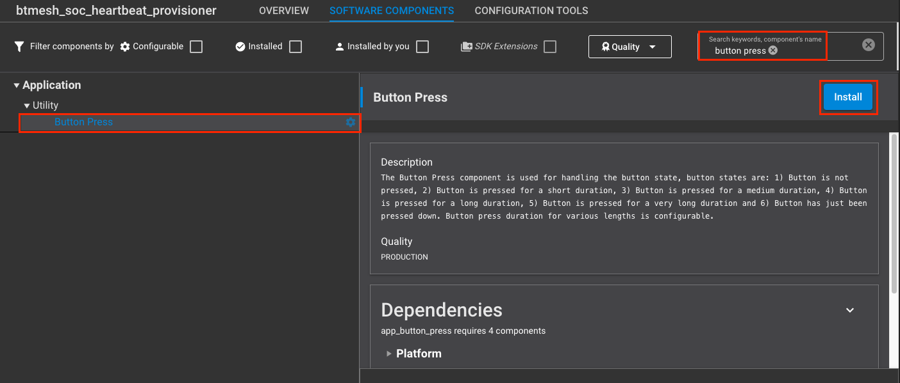

  - Switch on the ```Enable Virtual COM UART``` option at Platform > Board > Board Control (except Thunderbirds)
  
  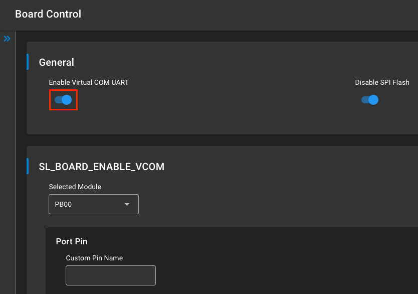

  - Add the Configuration Client Model in the Bluetooth Mesh Configurator to the Main Element (skipping this would result in SL_STATUS_BT_MESH_DOES_NOT_EXIST ((sl_status_t)0x0502))
 
  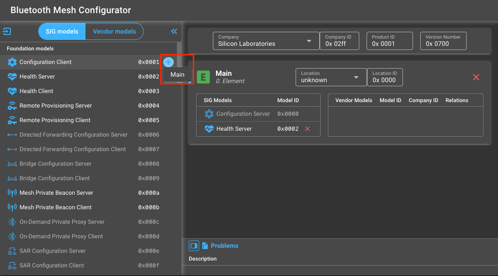

  - Increase the field values meant to store the data for Provisioned Devices (0 by default) at Bluetooth Mesh > Bluetooth Mesh Stack as per your needs
    - Maximum number of provisioned devices allowed
    - Maximum number of Application Keys allowed for each Provisioned Device
    - Maximum number of Network Keys allowed for each Provisioned Device
    - Maximum number of Client Commands for the Foundation Model
      - For detailed explanation of these fields see: https://www.silabs.com/documents/public/user-guides/ug472-bluetooth-mesh-v2x-node-configuration-users-guide.pdf

  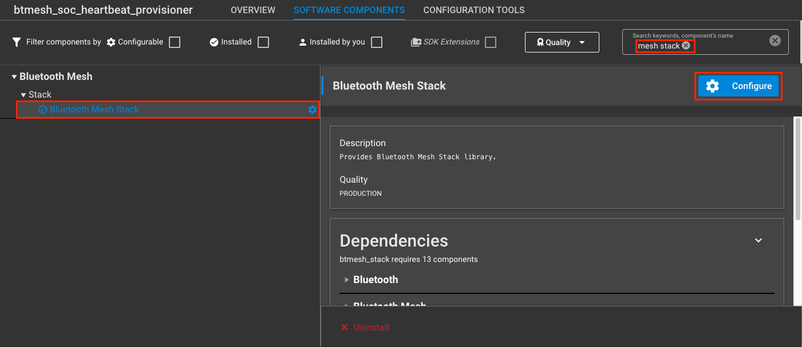
  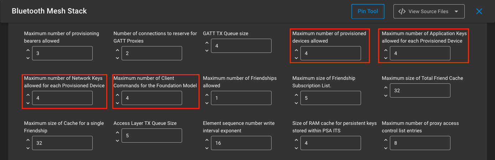

  - Import the config/gatt_configuration.btconf file in the Bluetooth GATT Configurator (Save it as well)

  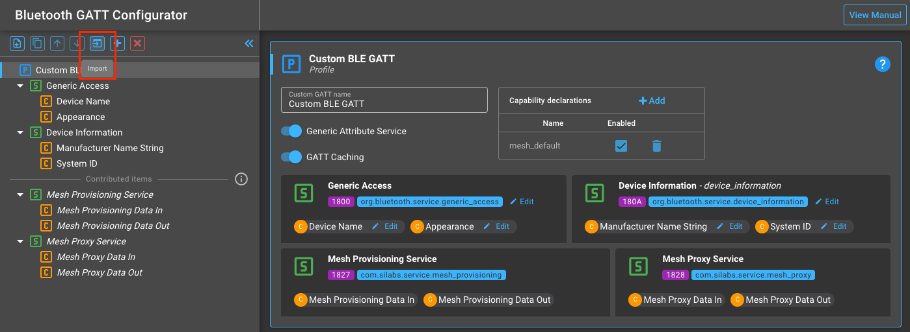

  - When everything is configured, build and flash the project
  - Flash the other boards with the ```Bluetooth Mesh - SoC Empty``` example project
  - Via the terminal, you can see that the Provisioner device has initialized and waiting for the WebApp connection
  
  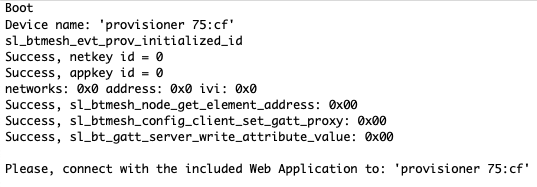
  
  - Open the included mesh_network.html in your browser (no HTTP server required) and tap Connect
  
  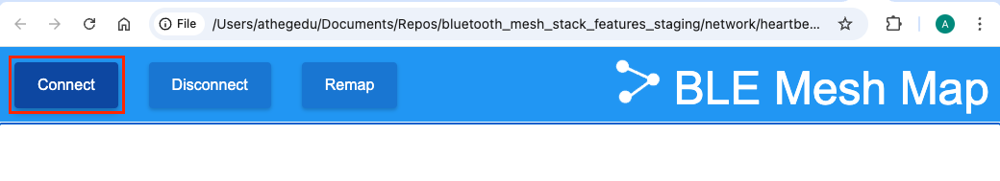

  - Select the advertising Provisioner and tap Pair
  
  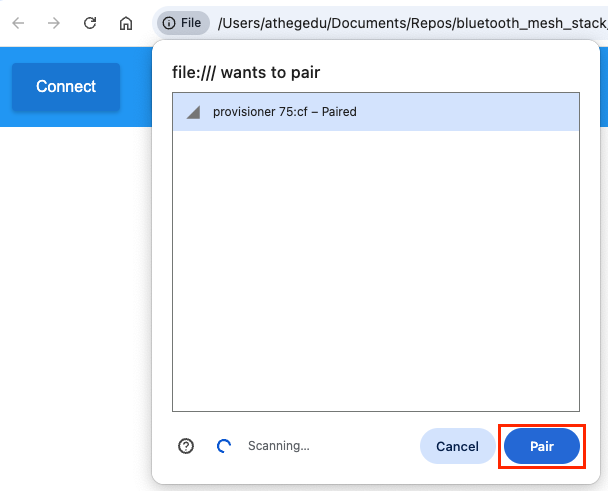

  - If all goes well, the Provisioner and the detected Unprovisioned nodes are starting to pop-up (and disappear dynamically) on the map
  
  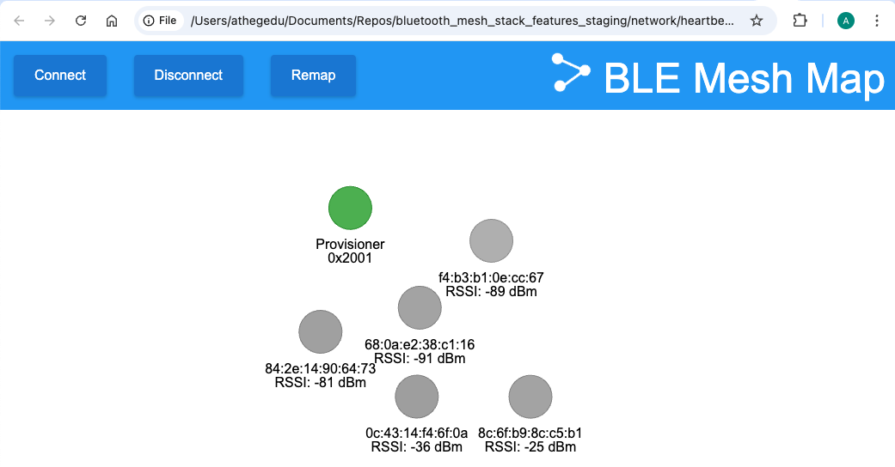

  - Double click on the desired node to provision it. The route mapping happens automatically
  
  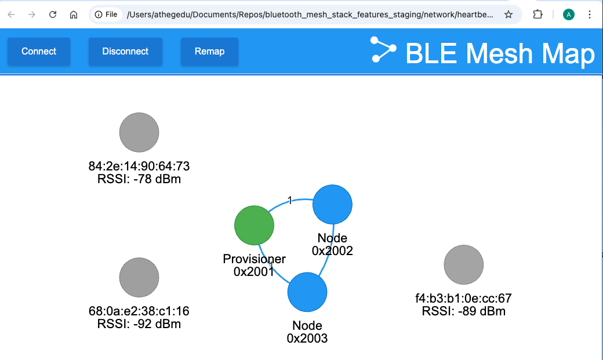
  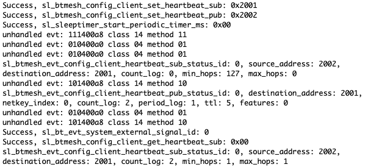

## Troubleshooting

  - On Windows operating systems there are certain caveats, that one should pay attention to:
    - Preliminary pairing might be necessary between the dev board and the computer
    - The operating system might show a different name for the dev board, due to name-caching
    - The browser might find the dev board easier, if it is inspected first on chrome://bluetooth-internals/#devices

---