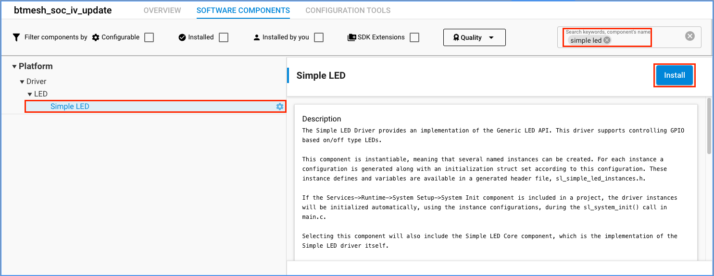
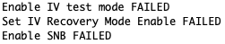
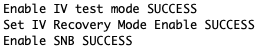
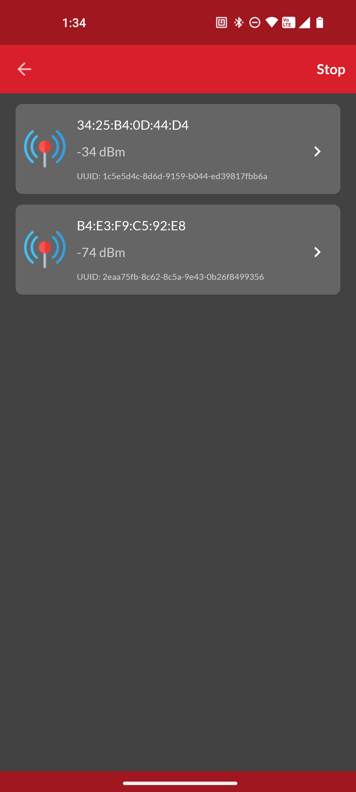
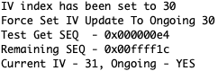

# IV Update Example

## Introduction

This example project is aimed to demonstrate the IV Index update process.

A Nonce is a number which may only be used once. Each time a message is encrypted, it is given a new nonce value. The nonce has various parts to it, including a sequence number and a value known as the IV Index. To ensure nonce values are unique for each new message encryption, the sequence number inside a nonce must not be allowed to wrap around while IV index remains unchanged.

The sequence number is a 24-bit value that allows an element to transmit 16,777,216 messages before repeating a nonce. If an element transmits a message on average once every second, then these sequence numbers would be exhausted after 194 days. To enable a mesh network to operate for longer periods of time than the sequence number space allows, an additional 4-octet value called the
IV (Initialization Vector) Index is defined that is included in the security nonce.

The IV Index is a 32-bit value that is a shared network resource (that is, all nodes in a mesh network share the same IV Index value and use it for all subnets they belong to). Its purpose is to provide entropy (randomness) in the calculation of message Nonce values. At the same frequency of one message every second, the lifetime of the network using the IV Index would measure in billions of years.

---

## Simplicity SDK version ##

SiSDK v2024.6.0

---

## Important

> ⚠ You are not required to follow through with the setup part of the Instructions when using our [*External Repos*](../../README.md) feature!

This project README assumes that the reader is familiar with the usage of SiliconLabs Simplicity Studio 5 and the provided example projects within it.

---

## Requirements

  - Simplicity Studio 5 with the latest SiSDK
  - 2x SiliconLabs WSTK with Radio Boards (for example BRD4187C)

---

## Instructions

  - This Example is based on the ```Bluetooth Mesh - SoC Light CTL``` included with the Silicon Labs SiSDK
  - Create a new project based on the ```Bluetooth Mesh - SoC Light CTL``` example
  - Copy the following files into the root directory of your project, overwrite the already existing ones:
    - src/app.c
    - inc/btmesh_change.h
    - src/btmesh_change.c
  - Add two "Platform > Driver > LED > Simple LED" components, named ```led0``` and ```led1```

  

  - Also, install the following components the same way as the one above:
    - Application > Utility > Button Press
    - Bluetooth Mesh > Models > Lighting > CTL Client
  - Install the "Bluetooth Mesh > Stack Classes > Test" component
  
  
  Without this component, the test fuctions would return ((sl_status_t)0x000F) SL_STATUS_NOT_SUPPORTED during the initialization
  
  

  - When everything is configured, build and flash the project
  - Flash the other board with the ```Bluetooth Mesh - SoC Light CTL``` demo or unchanged example
  - If everything went right, you should see the boards booting up 
  - If both of the WSTKs are running, provision them into the same network with SiliconLabs's own Bluetooth Mesh Application for Android/iOS.
  
  - After successful provisioning, assign them the roles of ```Light Lightness Client``` for the "Custom" and ```Light Lightness Server``` for the "Demo" board.
  - If everything is fine, you should be able to control the LEDs of the "Demo" board with the buttons on the "Custom" board
  - You can trigger the normal or force IV Update request with long pressing of the buttons on the WSTK
  
---

## IV Update Event

The IV Update procedure should be performed before the sequence number is exhausted. The procedure updates the IV index to a
new value that will be used for subsequent communication in the mesh network. Once the IV Update procedure completes, the sequence number is reset to 0 on every element of every node in the network.

The ```sl_btmesh_evt_node_changed_ivupdate_state_id``` event is generated when the IV Update procedure has started
or completed. The application can use this event to monitor the IV Update procedure state and the current IV index.

```c
  case sl_btmesh_evt_node_changed_ivupdate_state_id:
    LOGI("Current IV - %d, Ongoing - %s\r\n",
         evt->data.evt_node_changed_ivupdate_state.iv_index,
         evt->data.evt_node_changed_ivupdate_state.state ? "YES" : "NO");
    iv_index = evt->data.evt_node_changed_ivupdate_state.iv_index;
    iv_update_state = evt->data.evt_node_changed_ivupdate_state.state;
  break;
```

---

## IV Tests

There are time limits on the IV Update and IV Index Recovery procedures so testing on Bluetooth mesh applications would be inefficient. The IV Update test mode removes these time limits. The application can call the following API to enable the IV Update test mode.

```c
  sl_btmesh_test_set_ivupdate_test_mode(1);
```

The application should call the following API to request the stack to initiate the IV Update procedure.

```c
  sl_btmesh_node_request_ivupdate();
```