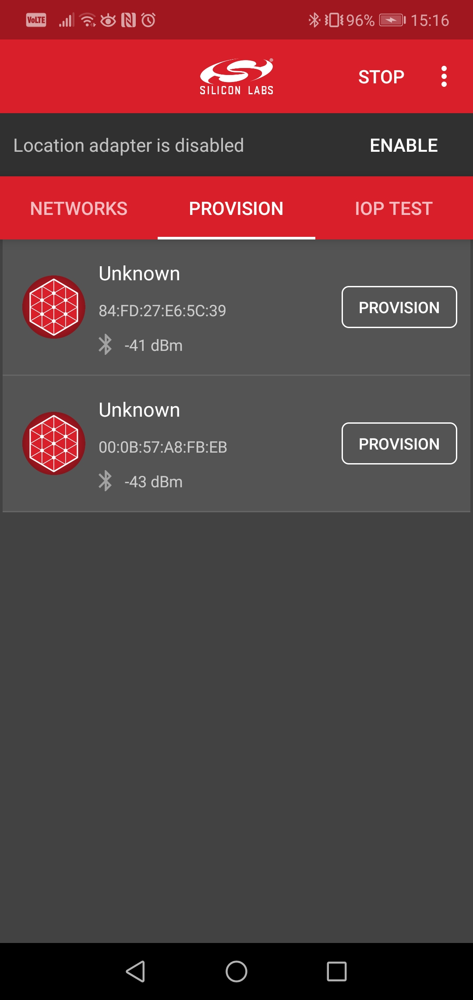

# IV Recovery Example

## Introduction

This example project is aimed to demonstrate the IV Index recovery process

A Nonce is a number which may only be used once. Each time a message is encrypted, it is given a new nonce value. The nonce has
various parts to it, including a sequence number and a value known as the IV Index. To ensure nonce values are unique for each new
message encryption, the sequence number inside a nonce must not be allowed to wrap around while IV index remains unchanged.

The sequence number is a 24-bit value that allows an element to transmit 16,777,216 messages before repeating a nonce. If an element transmits a message on average once every second, then these sequence numbers would be exhausted after 194 days. To enable a mesh network to operate for longer periods of time than the sequence number space allows, an additional 4-octet value called the
IV (Initialization Vector) Index is defined that is included in the security nonce.

The IV Index is a 32-bit value that is a shared network resource (that is, all nodes in a mesh network share the same IV Index value and
use it for all subnets they belong to). Its purpose is to provide entropy (randomness) in the calculation of message Nonce values. At the
same frequency of one message every second, the lifetime of the network using the IV Index would measure in billions of years.

---

## Important

This project README assumes that the reader is familiar with the usage of SiliconLabs Simplicity Studio 5 and the provided example projects within it.

---

## Requirements

  - Simplicity Studio 5 with the latest GSDK
  - 2x SiliconLabs WSTK with Radio Boards (for example BRD4162A)

---

## Instructions

  - This Example is based on the ```Bluetooth Mesh - SoC Light``` included with the Silicon Labs GSDK
  - Create a new project based on the ```Bluetooth Mesh - SoC Light``` example
  - Replace the original ```app.c``` file with the provided one, build and flash the board
  - Flash the other board with the ```Bluetooth Mesh - SoC Switch``` example
  - If everything went right, you should see the boards booting up 
  - If both of the WSTKs are running, provision them into the same network with SiliconLabs's own Bluetooth Mesh Application for Android/iOS.



  - After successful provisioning, create a Group for the two boards and assign them the roles of ```Generic OnOff Client``` for the "Switch" and ```Generic OnOff Server``` for the "Light" board.
  - If everything is fine, you should be able to control the LEDs of the "Light" board with the buttons on the "Switch" board
  - You can follow the status and changes of the IV Index through the console

---

## IV Recovery Event

The IV Index Recovery mode should be enabled when the node may have missed IV Index Updates and need to perform the IV Index
Recovery procedure. In this case, the following event is generated.

```c
  case sl_btmesh_evt_node_ivrecovery_needed_id:
    LOGI("IV recovery is needed. Current IV = %d, Received(Network) IV = %d\r\n",
          evt->data.evt_node_ivrecovery_needed.node_iv_index,
          evt->data.evt_node_ivrecovery_needed.network_iv_index);
  break;
```

---

## IV Tests

There are time limits on the IV Update and IV Index Recovery procedures so testing on Bluetooth mesh applications would be inefficient. The IV Update test mode removes these time limits. The application can call the following API to enable the IV Update test mode.

```c
  sl_btmesh_test_set_ivupdate_test_mode();
```

The application should check the received network IV Index and the
current IV Index that comes with the event and enable the IV Index Recovery mode only when the received network IV Index is greater
than the current IV Index and is equal to or less than the current IV Index + 42.

```c
  sl_btmesh_node_set_ivrecovery_mode(1);
```