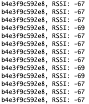

# Scanning BLE beacons in Bluetooth Mesh mode Example

## Summary ##

Bluetooth mesh is based on advertisements, meaning that under the hood the stack is scanning all the time. By default, the scan response events are not passed to the application but they are just consumed by the mesh stack and then silently discarded.

This example illustrated a way to scan BLE advertisements when the Bluetooth mesh stack is running. It looks through advertising data in scan response events and searches for the mesh proxy UUID `0x1828`. If a proxy advertisement is found, the address of the sender and RSSI are printed to debug output.

## Simplicity SDK version ##

SiSDK v2024.6.0

---

## Important

> ⚠ You are not required to follow through with the setup part of the Instructions when using our [*External Repos*](../../README.md) feature!

This project README assumes that the reader is familiar with the usage of SiliconLabs Simplicity Studio 5 and the provided example projects within it.

---

## Requirements

  - Simplicity Studio 5 with the latest SiSDK
  - 2x SiliconLabs WSTK with Radio Boards (for example BRD4187C)

## Instructions

  - This Example is based on the ```Bluetooth Mesh - SoC Light CTL``` included with the Silicon Labs SiSDK
  - Create a new project based on the ```Bluetooth Mesh - SoC Light CTL``` example
  - Copy the following files into the root directory of your project, overwriting the already existing ones:
    - src/app.c
  - When everything is configured, build and flash the projects
  - If everything went right, you should see the board booting up, then, you shall provision it
  - On another radio board, flash any Bluetooth mesh application consisting of the Mesh Proxy service with UUID `0x1828` (such as the [*Proxy Client Example*](../../proxy_protocol/proxy_client/README.md)) and provision it .
  - Open a serial terminal and observe the print statements



### Implementation 

1. Handle the scan response event by adding following case to the `sl_bt_on_event()` function:
```C
case sl_bt_evt_scanner_legacy_advertisement_report_id:
  print_scan_resp(&evt->data.evt_scanner_legacy_advertisement_report);
  break;
```

2. Add a function that handles the BLE scan responses, here's a sample:   
```C
static void print_scan_resp(sl_bt_evt_scanner_legacy_advertisement_report_t *pResp)
{
  // decoding advertising packets is done here. The list of AD types can be found
  // at: https://www.bluetooth.com/specifications/assigned-numbers/Generic-Access-Profile

  // example of adv data including proxy service data:020106030328181416281801fd65f619452875558774bc
  // (UUID 0x1828)

  // 020106-03032818-1416281801fd65f619452875558774bc
  const uint8_t proxy_UUID[16] = {0x28, 0x18};

  int i = 0;
  int ad_match_found = 0;
  int ad_len;
  int ad_type;

  while (i < (pResp->data.len - 1))
  {
    ad_len  = pResp->data.data[i];
    ad_type = pResp->data.data[i+1];

    if (ad_type == 0x03)
    {
      // type 0x03= Complete List of 16-bit Service Class UUIDs

      if(memcmp(proxy_UUID, &(pResp->data.data[i+2]),2) == 0)
      {
        ad_match_found = 1;
      }
    }

    //jump to next AD record
    i = i + ad_len + 1;
  }

  if(ad_match_found)
  {
    for(i=5;i>=0;i--)
    {
      app_log("%2.2x", pResp->address.addr[i]);
    }
    app_log(", RSSI: %d\r\n", pResp->rssi);
  }
```