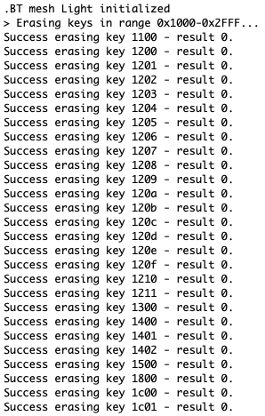
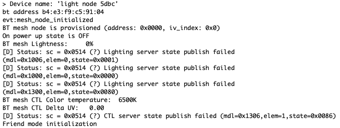

# Mesh Erase NVM #

## Description ##

The NVM3 driver provides a means to write and read data objects (key/value pairs) stored in flash. Wear-leveling is applied to
reduce erase and write cycles and maximize flash lifetime. The
driver is resilient to power loss and reset events, ensuring that
objects retrieved from the driver are always in a valid state. A single NVM3 instance can be shared among several wireless stacks
and application code, making it well-suited for multiprotocol applications. This application note explains how NVM3 can be used
as non-volatile data storage in Zigbee (EmberZNet), Open
Thread, Z-Wave, Bluetooth, and Connect applications.

This example project is aimed to demonstrate how to erase the entire Bluetooth Mesh configuration region from the NVM by deleting the associated keys. This example is not meant to be used in production code, see ```Known limitations```! The Bluetooth Mesh PS entries are stored between keys 0x1000 and 0x2FFF.

## Gecko SDK version ##

GSDK v4.1.1

---

## Important

This project README assumes that the reader is familiar with the usage of SiliconLabs Simplicity Studio 5 and the provided example projects within it.

---

## Requirements

  - Simplicity Studio 5 with the latest GSDK
  - SiliconLabs WSTK with Radio Board (for example BRD4162A)

## Known limitations:

  - To delete the Bluetooth Mesh configurations, in production please use:
    - ```sl_btmesh_initiate_full_reset();```
    - ```sl_btmesh_initiate_node_reset();```

## Instructions

  - This Example is based on the ```Bluetooth Mesh - SoC Light``` included with the Silicon Labs GSDK
  - Create a new project based on the ```Bluetooth Mesh - SoC Light``` example
  - Copy the following file into the root directory of your project, overwriting the already existing one:
    - app.c
    - mesh_erase_nvm.c/h
  - When everything is configured, build and flash the projects
  - If everything went right, you should see the board booting up
  - Now, you may provision the node into a Network and after that, erase the NVM content with pressing ```Button 0``` and ```Reset``` at the same time. You will notice that as the result of the loss of data, the node will not be able properly reinitialize.

  
  

---