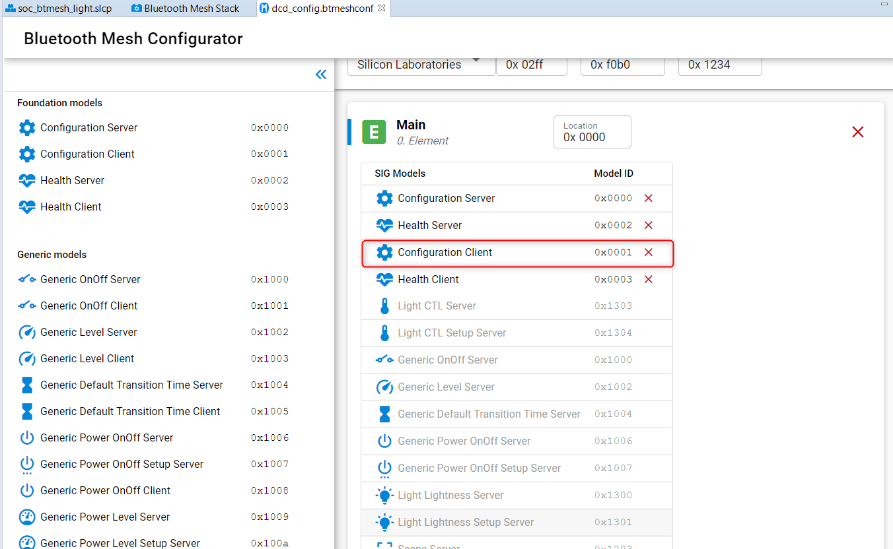

# Bluetooth Mesh embedded provisioner

This article includes a code example that implements a **Bluetooth mesh provisioner** that can be run on one of our Bluetooth capable development kits.

To understand how the provisioning and configuration of mesh nodes works, it is recommended that you first try out the mesh Android app as explained in the quickstart guide [QSG148](https://www.silabs.com/documents/login/quick-start-guides/qsg148-bluetooth-mesh-demo-quick-start-guide.pdf).

The example presented in this article can perform the same operations as the mobile app but it is more autonomous and requires only minimal input from the user. When the provisioner sees an unprovisioned beacon, it prints the UUID of this device to the debug console and then you can either:

\- push button PB1 to provision and configure the device.

\- push button PB0 to erase fully the device NVM which is where the node Mesh data base is stored.

 Alternatively the UART terminal can be used:

- By pressing the press key 'p' on the terminal you can provision a given device (identical to PB1).
- By pressing 'e' you can erase fully the NVM (identical to PB0).
- By pressing 'f' you can flush the terminal.

The purpose of this example is to show how the Silicon Labs BT mesh stack can be used in provisioning mode. The main steps in provisioning and configuration are summarized below, along with a list of related API calls.

NOTE: This example is intended only for small scale experimental use. It is not meant to be used as a basis for any production use and the code.

**Known limitations**:

- The provisioning data is stored in the EFR32 internal flash and has limited capacity, the maximum number of nodes this example can support is around 10-15
- the max number of SIG and vendor models is limited to 16 and 4, respectively (see definition of struct tsDCD)
- This example is missing many important features that are needed in a real production quality provisioner, such as:
  - key refresh, removal of a devices
  - removing nodes from the network

## Provisioning and configuration basic steps

The main steps included in provisioning a device into the network and configuring the node are summarized in the following table. This is just a compact list of what operations and API calls are involved in the process. More detailed information about provisioning and configuration in Bluetooth mesh can be found in:

- Mesh Profile specification by Bluetooth SIG, rev 1.0 (**Chapter 5 Provisioning**)
- <https://blog.bluetooth.com/provisioning-a-bluetooth-mesh-network-part-1>
- <https://blog.bluetooth.com/provisioning-a-bluetooth-mesh-network-part-2>

|              Step               |                         Description                          |                 Related API calls and events                 |
| :-----------------------------: | :----------------------------------------------------------: | :----------------------------------------------------------: |
| 1. Initialize provisionier mode | Initialize the Mesh stack in provisioner role. (wait for event |   sl_btmesh_prov_init, sl_btmesh_evt_mesh_prov_initialized   |
|         2. Create keys          | Application and network keys need to be created (unless they already exist) | sl_btmesh_prov_create_network, sl_btmesh_prov_create_appkey  |
|           3. Scanning           |           Start scanning for unprovisioned beacons           | sl_btmesh_prov_scan_unprov_beacons, sl_btmesh_evt_prov_unprov_beacon |
|      4. Start provisioning      | Start provisioning, using either PB-ADV or PB-GATT bearer *  | sl_btmesh_prov_provision_device, st_btmesh_prov_provision_gatt_device, sl_btmesh_evt_prov_device_provisioned |
|           5. Read DCD           | Read the device composition data (DCD) from the freshly provisioned node | sl_btmesh_config_client_get_dcd, sl_btmesh_evt_config_client_dcd_data, sl_btmesh_evt_mesh_config_client_dcd_data_end |
|         6. Send appkey          |             Push an application key to the node.             | sl_btmesh_config_client_add_appkey, sl_btmesh_evt_config_client_appkey_status |
|   7. Bind appkey to model(s)    |             Bind a model to an application key.              | sl_btmesh_config_client_bind_model, sl_btmesh_evt_config_client_binding_status |
|       8. Publish settings       |   Set a model's publication address, key, and parameters.    | sl_btmesh_config_client_set_model_pub, sl_btmesh_evt_config_client_model_pub_status |
|      9. Subscribe settings      |        Add an address to a model's subscription list.        | sl_btmesh_config_client_add_model_sub, sl_btmesh_evt_config_client_model_sub_status |

## Code example

The sample code is attached in a zip file. The zip file includes a **readme.md** file that explains step-by-step how this code can be installed on top of one of the examples in the Bluetooth mesh SDK.

The Silicon Labs Bluetooth Mesh SDK performs consistency checks on the non-volatile storage areas, that hold information such as keys, at startup. These areas are not erased when flashing a new application. If the application on the EFR32 is changed from embedded provisioner to something else, like a light or switch node, or from such a node to embedded provisioner, the entire contents of flash must be erased to avoid errors during initialization. This can be accomplished with Simplicity Commander

### Composition Data and Memory Configuration

In order for the provisioner to configure the nodes there are a few requirements that must be met.

Firstly, the config client must be added to the device composition data (DCD) as shown

The memory configuration tab contains several settings which must be modified as well. These parameters should all be set to non-zero, the default values for each are zero.

- max provisioned devices
- max provisioned device network keys
- max provisioned device application keys

For detailed descriptions of these settings please refer to section 3 of UG366.

## Conclusion

This article presenting the embedded provisioner is meant to offer a very quick and easy way to set up a small Bluetooth Mesh network.

This is for demonstration purposes only and the code associated with this article on Github is not suitable for production.
