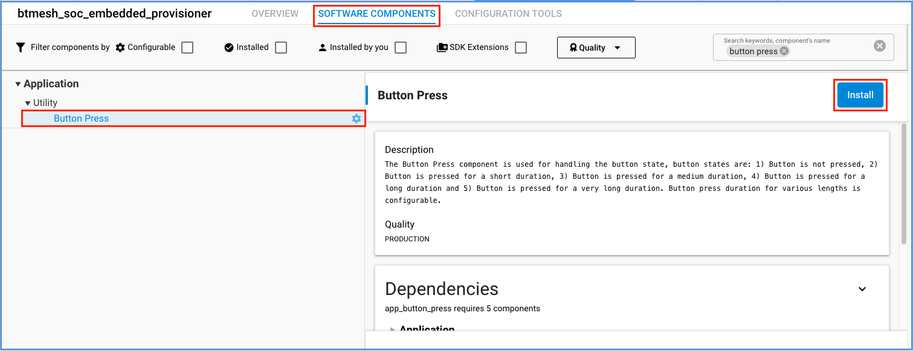
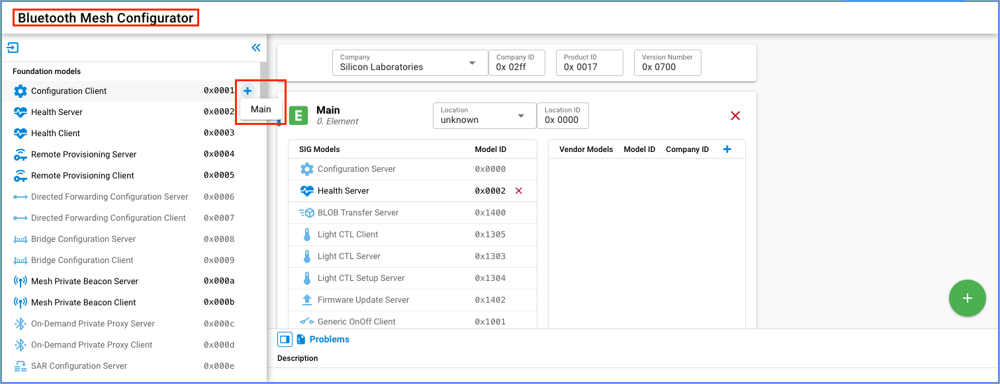
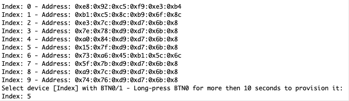

# Embedded Provisioner Example

## Description ##

Provisioner - A node that is capable of adding a device to a mesh network.

Provisioning is the process of adding a new, unprovisioned device to a Bluetooth mesh network, such as a light bulb. The process is managed by a provisioner. A provisioner and an unprovisioned device follow a fixed procedure which is defined in the Bluetooth mesh specification. A provisioner provides the unprovisioned device with provisioning data that allows it to become a Bluetooh mesh node.

This example is aimed to demonstrate our Mesh library's capabilities in building an embedded provisioner device and extracting the Device Composition Database data from the freshly provisioned node. The project also contains a Lightness/CTL Client implementation with all the necessary publish/subscribe configurations to be able to successfully control our ```Bluetooth Mesh - SoC Light CTL``` example.

## Simplicity SDK version ##

SiSDK v2024.6.0

---

## Important

> ⚠ You are not required to follow through with the setup part of the Instructions when using our [*External Repos*](../../README.md) feature!

This project README assumes that the reader is familiar with the usage of SiliconLabs Simplicity Studio 5 and the provided example projects within it.

---

## Requirements

  - Simplicity Studio 5 with the latest SiSDK
  - 2x SiliconLabs WSTK with Radio Boards (for example BRD4187C)

## Known limitations:

  - The provisioning data is stored in the EFR32 internal flash and has limited capacity, the maximum number of nodes this example can support is around 10-15 

  - This example is missing many important features that are needed in a real production quality provisioner, such as:
    - Key refresh, blacklisting of devices
    - Removing nodes from the network

## Instructions

  - This Example is based on the ```Bluetooth Mesh - SoC Light CTL``` included with the Silicon Labs SiSDK
  - Create a new project based on the ```Bluetooth Mesh - SoC Light CTL``` example
  - Copy the following files into the root directory of your project, overwrite the already existing ones:
    - src/app.c
    - inc/config.h
    - src/config.c
    - inc/btmesh_change.h
    - src/btmesh_change.c
  - Install the following components:
    - Application > Utility > Button Press
    - Bluetooth Mesh > Stack > Test
    - Bluetooth Mesh > Stack > Provisioner
    - Bluetooth Mesh > Btmesh Roles > Btmesh Provisioner
    - Bluetooth Mesh > Models > Lighting > CTL Client
    - Bluetooth Mesh > Stack > Models > Core > Configuration Client

  

  - Add the Configuration Client Model in the Bluetooth Mesh Configurator to the Main Element (skipping this would result in SL_STATUS_BT_MESH_DOES_NOT_EXIST ((sl_status_t)0x0502))
 
  

  - Increase the field values meant to store the data for Provisioned Devices (0 by default) at Bluetooth Mesh > Bluetooth Mesh Stack as per your needs
    - Maximum number of provisioned devices allowed
    - Maximum number of Application Keys allowed for each Provisioned Device
    - Maximum number of Network Keys allowed for each Provisioned Device
    - Maximum number of Client Commands for the Foundation Model
      - For detailed explanation of these fields see: https://www.silabs.com/documents/public/user-guides/ug472-bluetooth-mesh-v2x-node-configuration-users-guide.pdf

  
  

  - When everything is configured, build and flash the project
  - Flash the other board with ```Bluetooth Mesh - SoC Light CTL``` example project
  - Via the terminal, you can see when the Provisioner device noticed the Unprovisioned Beacon. Now, by pressing ```Button 0``` for more then 10 seconds on the Provisioner device, you can provision the newly noticed device into your network. If the provisioning is successful, the Provisioner will extract the DCD informations from the new Node. After you get to ```configuration complete```, you should be able to control the LEDs of the Node device with the buttons of the Provisioner device.

  

  - By pressing ```Button 1``` instead of ```Button 0``` for more then 10 seconds, you can list all the unprovisioned Nodes noticed so far, and selectively provision one of them.

  

---