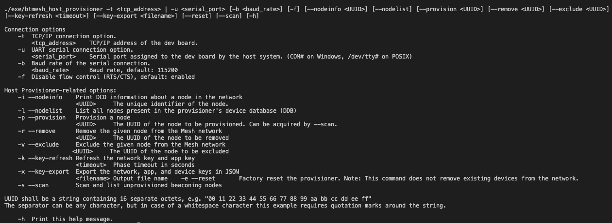

# Host Provisioner Example

## Description ##

Provisioner - A node that is capable of adding a device to a mesh network.

Provisioning is the process of adding a new, unprovisioned device to a Bluetooth mesh network, such as a light bulb. The process is managed by a provisioner. A provisioner and an unprovisioned device follow a fixed procedure which is defined in the Bluetooth mesh specification. A provisioner provides the unprovisioned device with provisioning data that allows it to become a Bluetooh mesh node.

This example is aimed to demonstrate our Mesh library's capabilities in building a host provisioner solution with a RaspberryPi as an NCP host and a WSTK board as an NCP target.

---

## Simplicity SDK version ##

SiSDK v2024.6.0

## Important

This project README assumes that the reader is familiar with the usage of SiliconLabs Simplicity Studio 5 and the provided example projects within it. This example is based on the ```Host Provisioner Example``` one, already available in Simplicity Studio 5, extended with the node "exclusion list" functionality and provided in a collection of source files instead of components.

---

## Requirements

  - Simplicity Studio 5 with the latest SiSDK
  - SiliconLabs WSTK with a Radio Board (for example BRD4187C)
  - RaspberryPi or other personal computer with POSIX compliant environment

## Known limitations:

  - EFR32xG22 boards are not supported

## Instructions

  - Open a new terminal on the computer
  - Navigate to the project's folder
  - Build the sample app by typing ```make```
  - Optionally, set the ```SDK_DIR``` environment variable to the path of your chosen SiSDK (i.e. ```make SDK_DIR=/Users/<user>/SimplicityStudio/SDKs/simplicity_sdk```)
  - Flash the radio board with the ```Bluetooth Mesh - NCP Empty``` example included with the Silicon Labs SiSDK
  - Connect the NCP target to the NCP host (if the NCP host differs from the computer used to flash the radio board)
  - Run the sample app with appropriate parameters (e.g. ```./exe/btmesh_host_provisioner -u /dev/tty.usbmodem0004402960811```)
  - Type the desired functionality, which you would like to perform:

  

  - You are free to run the program with command line arguments as well:

  

---