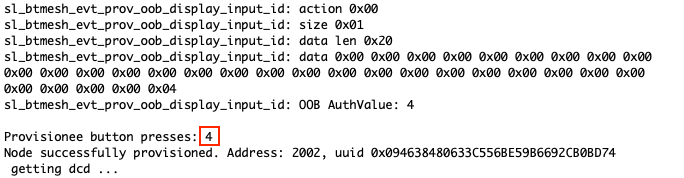
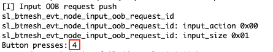

# Embedded Provisioner with OOB authentication #

## Description ##

Provisioner - A node that is capable of adding a device to a mesh network.

Provisioning is the process of adding a new, unprovisioned device to a Bluetooth mesh network, such as a light bulb. The process is managed by a provisioner. A provisioner and an unprovisioned device follow a fixed procedure which is defined in the Bluetooth mesh specification. A provisioner provides the unprovisioned device with provisioning data that allows it to become a Bluetooh mesh node.

The out of band (OOB) association model is designed for scenarios where an out of band mechanism is used to both discover the devices as well as to exchange or transfer cryptographic information which would be used in the pairing process. Out of band is a flexible option for developers that allows you to define some of your own pairing mechanisms, so the security level depends on out of band protection capability.

This example is aimed to demonstrate our Mesh library's capabilities in building an embedded provisioner device with out of band authentication and extracting the Device Composition Database data from the freshly provisioned node. The example also contains the necessary codes for a node to-be provisioned (provisionee) with the OOB support, required for the full demonstration.

## Gecko SDK version ##

GSDK v4.1.1

---

## Important

This project README assumes that the reader is familiar with the usage of SiliconLabs Simplicity Studio 5 and the provided example projects within it.

---

## Requirements

  - Simplicity Studio 5 with the latest GSDK
  - 2x SiliconLabs WSTK with Radio Boards (for example BRD4187C)

## Known limitations:

  - The provisioning data is stored in the EFR32 internal flash and has limited capacity, the maximum number of nodes this example can support is around 10-15 
  - Output, Static and NoOOB not demonstrated separately, due to they being nearly identical
  - Public key sharing is not demonstrated

## Instructions

  - The example contains files for two separate projects, both for Provisioner and Provisionee nodes, placed in the appropriately named folders
  - For the Provisioner, please follow the instructions, found in the Embedded Provisioner Example, except:
  - Copy the following file into the root directory of your project, overwriting the already existing one:
    - app.c
  - For the Provisionee, please, see below:
  - Create a new project based on the ```Bluetooth Mesh - SoC Switch``` example
  - Copy the following file into the root directory of your project, overwriting the already existing one:
    - app.c
  - When everything is configured, build and flash the projects
  - Via the terminal, you can see when the Provisioner device noticed the Unprovisioned Beacon. Now, by pressing ```Button 1``` on the Provisioner device, you can provision the newly noticed device into your network.
  - After the provisioning started, you have 5 seconds (adjustable with the ```APP_OOB_COUNTER_TIMEOUT```) to enter the OOB ```AuthValue``` into the Provisionee node with the ```Button 1``` pushbutton.

  
  

  - If the provisioning is successful, the Provisioner will extract the DCD informations from the new Node.

  

---