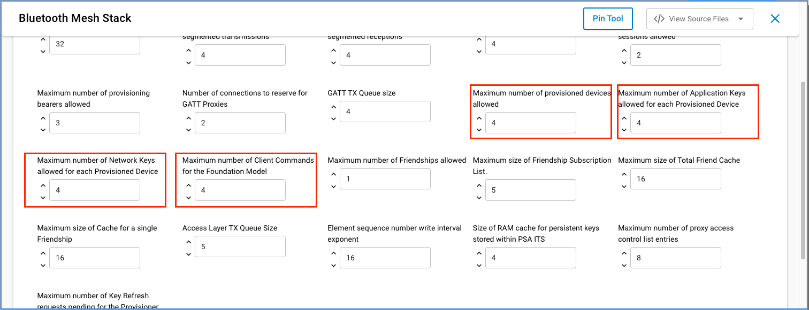
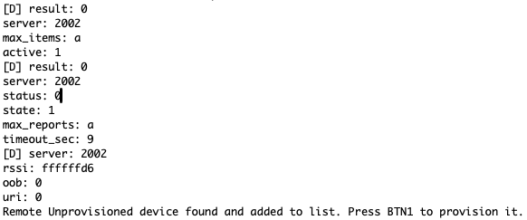
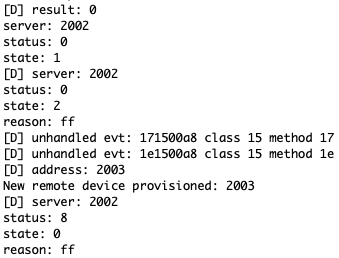
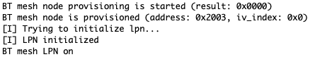

# Remote Provisioning Example #

## Description ##

Provisioner - A node that is capable of adding a device to a mesh network.

Provisioning is the process of adding a new, unprovisioned device to a Bluetooth mesh network, such as a light bulb. The process is managed by a provisioner. A provisioner and an unprovisioned device follow a fixed procedure which is defined in the Bluetooth mesh specification. A provisioner provides the unprovisioned device with provisioning data that allows it to become a Bluetooh mesh node.

This example demonstrates the Remote Provisioning feature of the Silicon Labs Mesh SDK. With it, a device can be provisioned without a direct radio connection between the provisioner and the unprovisioned node. The feature uses standard Mesh networking between the provisioner and a Remote Provisioning Server, so that the server can provision any device in the radio range of the network. The PB-Remote bearer allows a Provisioner that is outside immediate radio range of an unprovisioned device to communicate with a node supporting the Remote Provisioning Server model that is within immediate radio range of the unprovisioned device, and to use that node as a re-transmitter to communicate with the unprovisioned device using PB-ADV or PB-GATT.


## Gecko SDK version ##

GSDK v4.2.1

---

## Important

This project README assumes that the reader is familiar with the usage of SiliconLabs Simplicity Studio 5 and the provided example projects within it. These examples are designed to be able to run on such low capability devices as an MG12, but keep the memory consumption in check.

---

## Requirements

  - Simplicity Studio 5 with the latest GSDK
  - 3x SiliconLabs WSTK with Radio Boards (for example BRD4161A)

## How it works

The way how this example is structured is aimed to demonstrate and ease the understanding of the Remote Provisioning feature. In the ```client``` folder, you can find the source for the ```Embedded Provisioner / Remote Provisioning Client (RPC)```, in the ```server``` folder, the source for the ```Remote Provisioning Server (RPS)```. The ```RPC``` is looking for a special advertisement from the ```RPS``` device, and only provisions those device(s) directly which ones are sending these advertisements. The provisioning is automatic and no other device will be provisioned, be it in or out of the ```RPC```'s radio range! See the instructions below, how to provision all the other devices nearby via the Remote Provisioning protocol.

## Instructions

  - The example contains files for two separate projects, a Client and a Server node, placed in the appropriately named folders
  - For the Client, create a new project based on the ```Bluetooth Mesh - SoC Empty``` example
  - Copy the following file into the root directory of your project, overwriting the already existing one:
    - client/src/app.c
  - Install the following components:
    - Application > Utility > Button Press
    - Bluetooth Mesh > Stack > Provisioner
    - Bluetooth Mesh > Stack > Models > Core > Configuration Client
    - Bluetooth Mesh > Models > Remote Provisioning > Remote Provisioning Client
    - Services > IO Stream > Driver > IO Stream: USART (keep the original ```vcom``` name)
    - Application > Utility > Log

  

  - Add the Configuration Client Model in the Bluetooth Mesh Configurator to the Main Element (skipping this would result in SL_STATUS_BT_MESH_DOES_NOT_EXIST ((sl_status_t)0x0502))
 
  

  - Increase the field values meant to store the data for Provisioned Devices (0 by default) at Bluetooth Mesh > Stack > Bluetooth Mesh Stack as per your needs
    - Maximum number of provisioned devices allowed
    - Maximum number of Application Keys allowed for each Provisioned Device
    - Maximum number of Network Keys allowed for each Provisioned Device
    - Max Foundation Client Cmds
      - For detailed explanation of these fields see: https://www.silabs.com/documents/public/user-guides/ug472-bluetooth-mesh-v2x-node-configuration-users-guide.pdf

  
  

  - Switch on the ```Enable Virtual COM UART``` option at Platform > Board > Board Control

  

  - When everything is configured, build and flash the project
  - When it successfully boots up, it is going to create the Mesh network and starts to listen for the ```RPS``` device advertisements

  

  - In the next step, create the project for the Server device based on the ```Bluetooth Mesh - SoC Empty``` example
  - Copy the following file into the root directory of your project, overwriting the already existing one:
    - server/src/app.c
  - Install the following components:
    - Bluetooth Mesh > Models > Remote Provisioning > Remote Provisioning Server
    - Services > IO Stream > Driver > IO Stream: USART (keep the original ```vcom``` name)
    - Application > Utility > Log
  - Switch on the ```Enable Virtual COM UART``` option at Platform > Board > Board Control
  - When everything is configured, build and flash the project
  - When the ```RPS``` device goes online, it will instantly starts to advertise, and gets to be provisioned as soon as the ```RPC``` notices it

  
  

  - Now, this is the good time for flashing the third WSTK with the ```Bluetooth Mesh - SoC Switch``` demo example, to serve as an unprovisioned device (```SW```)

  

  - When done with the flashing, as the ```RPC``` device instructs you above, press the Button 0 for about 3 seconds, to remote scan for other unprovisioned devices
  - The ```RPC``` device logs it, when it was able to find our ```SW``` device

  

  - As the ```RPC``` device instructs you, press Button 1 to attempt to remote provision the found ```SW``` device
  - If successful, you will be able to see it via the terminals

  
  

---