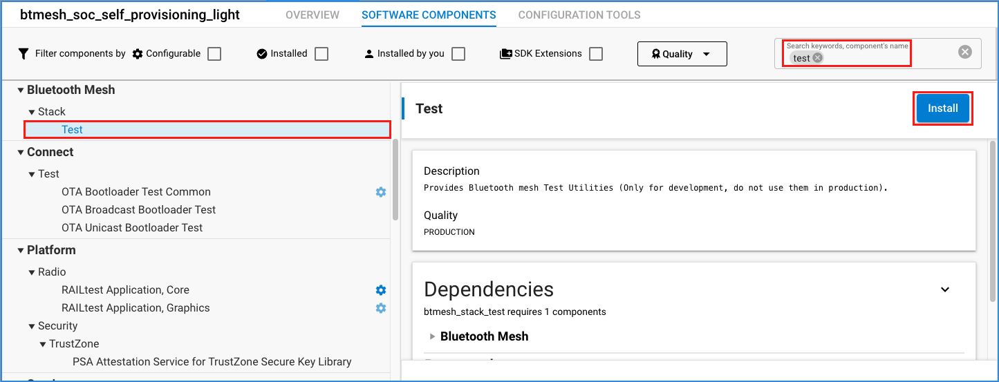
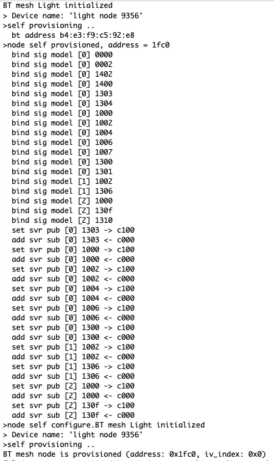

# Self Provisioning Example #

## Description ##

Provisioner - A node that is capable of adding a device to a mesh network.

Provisioning is the process of adding a new, unprovisioned device to a Bluetooth mesh network, such as a light bulb. The process is managed by a provisioner. A provisioner and an unprovisioned device follow a fixed procedure which is defined in the Bluetooth mesh specification. A provisioner provides the unprovisioned device with provisioning data that allows it to become a Bluetooh mesh node.

This example is aimed to demonstrate how to set up a fully pre-configured Bluetooth Mesh network with everything being hard-coded into the nodes. This solution is only for test purposes and in no way suggested for live application! Developing self-provisioning firmware for BLE Mesh Devices allows for the rapid development of test networks without the need for a provisioner (usually in the form of a mobile app) to set the network configuration.

## Gecko SDK version ##

GSDK v4.1.1

---

## Important

This project README assumes that the reader is familiar with the usage of SiliconLabs Simplicity Studio 5 and the provided example projects within it.

---

## Requirements

  - Simplicity Studio 5 with the latest GSDK
  - 2x SiliconLabs WSTK with Radio Boards (for example BRD4187C)

## Known limitations:

  - The provisioning data is stored in the EFR32 internal flash and has limited capacity, the maximum number of nodes this example can support is around 10-15 

## Instructions

  - The example contains files for two separate projects, a Light and a Switch node, placed in the appropriately named folders
  - Create a new project based on the ```Bluetooth Mesh - SoC Light``` example
  - Copy the following file into the root directory of your project, overwriting the already existing one:
    - app.c
  - Install the following components:
    - Bluetooth Mesh > Stack Classes > Test

  

  - When everything is configured, build and flash the projects
  - Create a new project based on the ```Bluetooth Mesh - SoC Switch``` example
  - Copy the following file into the root directory of your project, overwriting the already existing one:
    - app.c
  - Install the following components:
    - Bluetooth Mesh > Stack Classes > Test
  - When everything is configured, build and flash the projects
  - If everything is fine, the nodes should quickly find each other and with the push buttons of the Switch node you may control the Light node

  
  

---